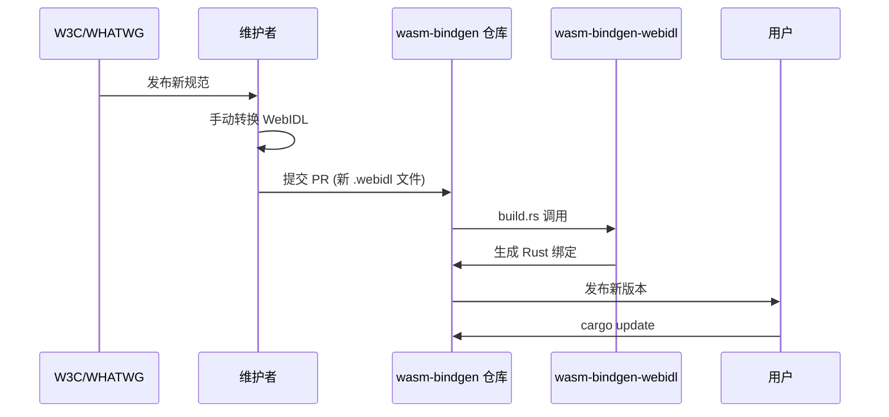
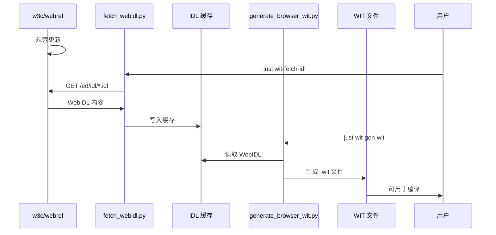

# wasm-bindgen/web-sys 与 Tairitsu W3C 标准同步机制对比与改进报告

## 执行摘要

本报告分析了 `wasm-bindgen/web-sys` 和 `Tairitsu` 项目如何与 W3C 标准同步，并提出了改进建议以帮助 Tairitsu 更好地替代这些设施。

## 目录

1. [背景与目标](#1-背景与目标)
2. [wasm-bindgen/web-sys 同步机制](#2-wasm-bindgenweb-sys-同步机制)
3. [Tairitsu 同步机制](#3-tairitsu-同步机制)
4. [对比分析](#4-对比分析)
5. [改进建议](#5-改进建议)
6. [实施路线图](#6-实施路线图)

---

## 1. 背景与目标

### 1.1 问题陈述

Web 平台 API 由 W3C/WHATWG 通过 WebIDL 规范定义。Rust WASM 生态系统需要将这些规范转换为可用的 Rust 绑定。当前主要有两种方案：

- **wasm-bindgen/web-sys**: 将 WebIDL 编译为 wasm-bindgen 绑定
- **Tairitsu**: 将 WebIDL 编译为 WIT (WebAssembly Interface Types)

### 1.2 调研目标

1. 分析 wasm-bindgen/web-sys 的 WebIDL 同步机制
2. 分析 Tairitsu 的 WebIDL 同步机制
3. 对比两种方案的优劣
4. 提出 Tairitsu 改进建议

---

## 2. wasm-bindgen/web-sys 同步机制

### 2.1 架构概览

```
┌─────────────────────────────────────────────────────────────┐
│                    wasm-bindgen/web-sys                      │
├─────────────────────────────────────────────────────────────┤
│                                                               │
│  ┌──────────────┐      ┌──────────────┐      ┌───────────┐  │
│  │  WebIDL 文件  │ ───> │  WebIDL 前端 │ ───> │  Rust 绑定 │  │
│  │  (手动维护)   │      │ (wasm-bindgen)│      │   生成     │  │
│  └──────────────┘      └──────────────┘      └───────────┘  │
│         ▲                                            │       │
│         │                                            │       │
│    手动同步                                        build.rs   │
│    (人工审查)                                       包含生成   │
│                                                         代码   │
└─────────────────────────────────────────────────────────────┘
```

### 2.2 数据源

**WebIDL 来源**: `crates/web-sys/webidls/enabled/*.webidl`

- **维护方式**: 手动维护
- **更新频率**: 人工 PR 更新
- **数据来源**:
  - W3C 规范
  - WHATWG 规范 (HTML、DOM、Fetch 等)
  - 浏览器厂商扩展

### 2.3 构建流程

**build.rs 机制**:

```rust
// build.rs 调用 wasm-bindgen WebIDL 前端
// 1. 读取 webidls/enabled/*.webidl
// 2. 调用 wasm-bindgen-webidl 工具
// 3. 输出到 OUT_DIR 生成的 Rust 代码
// 4. src/lib.rs 通过 include! 包含生成的代码
```

### 2.4 特征系统

每个 WebIDL 接口对应一个 Cargo feature：

```toml
[features]
Window = []
Document = []
Element = []
# ... 数百个 feature
```

**优点**:

- 按需编译，减少编译时间
- 精确控制依赖

**缺点**:

- 特征数量爆炸（数百个）
- 用户需要手动启用所有相关特征

### 2.5 类型映射

| WebIDL 类型 | Rust 类型 |
|------------|-----------|
| `boolean` | `bool` |
| `octet` | `u8` |
| `unsigned long` | `u32` |
| `DOMString` | `String` |
| `sequence<T>` | `Vec<T>` / `js_sys::Array` |
| `Promise<T>` | `js_sys::Promise` / `wasm_bindgen::JsCast` |
| 接口类型 | `JsCast` trait 对象 |

### 2.6 同步流程



**关键点**: 整个过程需要**人工干预**，没有自动化同步机制。

### 2.7 优点与缺点

**优点**:

1. ✅ 成熟稳定，广泛使用
2. ✅ 与 wasm-bindgen 深度集成
3. ✅ 生成代码质量高，经过大量测试
4. ✅ 每个接口独立 feature，编译灵活

**缺点**:

1. ❌ **手动维护 WebIDL**，更新不及时
2. ❌ **没有自动化同步** W3C 规范
3. ❌ feature 数量爆炸，使用复杂
4. ❌ 生成代码体积大（每个接口独立）
5. ❌ 依赖 JavaScript 互操作，不是真正的 WASI 绑定

---

## 3. Tairitsu 同步机制

### 3.1 架构概览

```
┌─────────────────────────────────────────────────────────────────────┐
│                        Tairitsu WIT Pipeline                        │
├─────────────────────────────────────────────────────────────────────┤
│                                                                       │
│  ┌──────────────┐      ┌──────────────┐      ┌──────────────┐      │
│  │ W3C webref   │ ───> │ WebIDL 缓存   │ ───> │  WIT 文件     │      │
│  │ (自动获取)    │      │(自动下载)     │      │ (自动生成)    │      │
│  └──────────────┘      └──────────────┘      └──────────────┘      │
│         ▲                                            │             │
│         │                                            ▼             │
│    GitHub API                                   packages/           │
│  (w3c/webref)                                  browser-worlds/       │
│                                                   wit/generated/     │
│                                                                       │
│  ┌────────────────────────────────────────────────────────────────┐ │
│  │                     脚本工具链                                 │ │
│  │  • scripts/fetch_webidl.py    - 从 webref 获取 WebIDL         │ │
│  │  • scripts/generate_browser_wit.py - WebIDL → WIT 转换        │ │
│  └────────────────────────────────────────────────────────────────┘ │
└─────────────────────────────────────────────────────────────────────┘
```

### 3.2 数据源

**WebIDL 来源**: `https://github.com/w3c/webref/tree/main/ed/idl`

- **维护方式**: 自动化获取
- **更新频率**: 按需运行 `just wit-fetch-idl`
- **数据来源**: W3C webref 仓库（官方维护的 WebIDL 汇总）

**支持的规范数量**: **50+** 个 W3C/WHATWG 规范

### 3.3 构建流程

**自动生成脚本**:

```bash
# 1. 获取 WebIDL (从 w3c/webref)
just wit-fetch-idl

# 2. 生成 WIT 文件
just wit-gen-wit

# 3. 完整流程
just wit-gen
```

### 3.4 类型映射

| WebIDL 类型 | WIT 类型 |
|------------|----------|
| `boolean` | `bool` |
| `octet` | `u8` |
| `unsigned long` | `u32` |
| `DOMString` | `string` |
| `sequence<T>` | `list<T>` |
| `Promise<T>` | `future<T>` 或回调 |
| 接口类型 | `u64` (opaque handle) |

**关键差异**: Tairitsu 使用 **opaque handles (u64)** 表示浏览器对象，符合 WASI Component Model 设计。

### 3.5 同步流程



**关键点**: **完全自动化**，无需人工干预。

### 3.6 领域划分

Tairitsu 将 Web API 按领域划分为 **26 个包**：

| 领域 | WIT 包 | 涵盖规范 |
|-----|-------|---------|
| dom | `tairitsu-browser:dom` | DOM, Fullscreen, Selection API |
| events | `tairitsu-browser:events` | UI Events, Pointer Events, Touch Events |
| html | `tairitsu-browser:html` | HTML Living Standard |
| css | `tairitsu-browser:css` | CSSOM, CSSOM View, CSS Animations |
| fetch | `tairitsu-browser:fetch` | Fetch, XHR, Streams, File API |
| ... | ... | ... |

### 3.7 缓存机制

**WebIDL 缓存**: `target/tairitsu-wit/webidl-cache/`

- 使用 `--force` 强制重新下载
- 支持离线工作
- SHA256 完整性验证

**WIT 嵌入**: `packages/browser-worlds/wit/generated/`

- 编译时嵌入 WIT 文件
- 提供离线后备方案
- 版本化管理 (0.2.0)

### 3.8 优点与缺点

**优点**:

1. ✅ **完全自动化** W3C 同步
2. ✅ 使用官方 webref 数据源
3. ✅ 生成的 WIT 符合 Component Model
4. ✅ 领域划分清晰，易于管理
5. ✅ 支持离线构建
6. ✅ Opaque handles 模式更安全
7. ✅ 真正的 WASI 绑定（不依赖 JS 互操作）

**缺点**:

1. ❌ 生态系统较新，不如 web-sys 成熟
2. ❌ 需要更多测试和验证
3. ❌ 文档和示例较少

---

## 4. 对比分析

### 4.1 同步机制对比

| 维度 | wasm-bindgen/web-sys | Tairitsu |
|-----|---------------------|----------|
| **数据源** | 手动维护的 WebIDL | w3c/webref (自动获取) |
| **更新方式** | 人工 PR | 自动化脚本 |
| **更新频率** | 不定期 | 按需（可定期） |
| **人工审查** | 需要 | 可选 |
| **离线支持** | 是（代码在仓库） | 是（嵌入 + 缓存） |
| **版本追踪** | Git commit | 语义化版本 |

### 4.2 技术架构对比

| 维度 | wasm-bindgen/web-sys | Tairitsu |
|-----|---------------------|----------|
| **目标格式** | wasm-bindgen 绑定 | WIT (Component Model) |
| **运行时** | JavaScript 互操作 | WASI 组件模型 |
| **对象表示** | JsCast trait 对象 | u64 opaque handles |
| **类型安全** | 编译时 + 运行时 | 完全编译时 |
| **包管理** | Cargo features | WIT 包 |
| **模块化** | 每个接口一个 feature | 按领域划分 |

### 4.3 开发体验对比

| 维度 | wasm-bindgen/web-sys | Tairitsu |
|-----|---------------------|----------|
| **使用复杂度** | 高（需要启用多个 feature） | 中（按领域导入） |
| **编译时间** | 长（特征解析开销） | 短（WIT 编译优化） |
| **代码体积** | 大（每个接口独立） | 小（共享基础设施） |
| **文档质量** | 优秀 | 发展中 |
| **社区支持** | 成熟 | 新兴 |

### 4.4 标准覆盖率

| 领域 | wasm-bindgen/web-sys | Tairitsu |
|-----|---------------------|----------|
| DOM API | ✅ 完整 | ✅ 完整 |
| HTML API | ✅ 完整 | ✅ 完整 |
| CSS API | ✅ 完整 | ✅ 完整 |
| Fetch/XHR | ✅ 完整 | ✅ 完整 |
| WebGL/WebGPU | ✅ 完整 | 🔄 部分 |
| WebRTC | ✅ 完整 | ✅ 完整 |
| Service Workers | ✅ 完整 | ✅ 完整 |
| 新兴 API | 🔄 需手动更新 | ✅ 自动同步 |

---

## 5. 改进建议

### 5.1 短期改进（1-3 个月）

#### 5.1.1 增强 WebIDL 解析器

**目标**: 提高覆盖率，支持更多 WebIDL 特性

```python
# 当前限制
- 部分高级 WebIDL 特性未支持
- 某些类型映射需要完善

# 改进方向
1. 添加 WebIDL 解析测试套件
2. 实现完整的 WebIDL 2.0 规范支持
3. 添加类型别名支持
4. 改进 mixin 处理
5. 支持命名空间枚举
```

#### 5.1.2 自动化 CI/CD

**目标**: 定期自动同步 W3C 规范

```yaml
# .github/workflows/wit-sync.yml
name: WIT Sync with W3C
on:
  schedule:
    - cron: '0 0 * * 0'  # 每周日
  workflow_dispatch:

jobs:
  sync:
    runs-on: ubuntu-latest
    steps:
      - uses: actions/checkout@v3
      - name: Fetch W3C WebIDL
        run: just wit-fetch-idl
      - name: Generate WIT
        run: just wit-gen-wit
      - name: Check for changes
        run: |
          if git diff --exit-code; then
            echo "No changes"
          else
            echo "Changes detected - creating PR"
            # 创建 PR
          fi
```

#### 5.1.3 版本管理策略

**目标**: 清晰的版本追踪和变更日志

```
packages/browser-worlds/wit/generated/
├── dom@0.2.0.wit        # 当前版本
├── dom@0.2.1.wit        # 新版本（如有变更）
└── CHANGELOG.md         # 变更日志
```

### 5.2 中期改进（3-6 个月）

#### 5.2.1 TypeScript 类型生成

**目标**: 从 WIT 生成 TypeScript 类型定义

```typescript
// packages/browser-glue/src/generated/dom.d.ts
export interface Event {
  readonly type: string;
  readonly target: EventTarget | null;
  stopPropagation(): void;
  // ...
}
```

#### 5.2.2 兼容性测试框架

**目标**: 验证生成的绑定与浏览器实现的兼容性

```rust
// packages/browser-compat/tests/
mod dom_tests {
    #[test]
    fn test_event_bubbles() {
        // 测试生成的 Event 接口与实际浏览器行为一致
    }
}
```

#### 5.2.3 文档生成

**目标**: 从 WIT 生成 API 文档

```markdown
# packages/browser-worlds/docs/dom.md

## Event

源自: [DOM Standard](https://dom.spec.whatwg.org/)

### 方法

#### `stopPropagation()`

停止事件传播。

```rust
event.stop_propagation();
```

```

### 5.3 长期改进（6-12 个月）

#### 5.3.1 渐进式迁移工具

**目标**: 帮助用户从 web-sys 迁移到 Tairitsu

```rust
// migration-tool/src/lib.rs

/// 将 web-sys 代码转换为 Tairitsu 代码
pub fn migrate_web_sys_to_tairitsu(
    web_sys_code: &str,
) -> Result<String, MigrationError> {
    // 1. 解析 web-sys API 使用
    // 2. 映射到对应的 Tairitsu WIT 接口
    // 3. 生成等效代码
}
```

#### 5.3.2 WASI 组件运行时优化

**目标**: 优化 opaque handles 的性能

```
当前: 每次调用都需要 handle 表查找
优化: 引入 handle 缓存和重用机制
```

#### 5.3.3 多语言支持

**目标**: 支持从其他语言使用生成的 WIT

```
WIT → Rust 绑定 (已有)
WIT → JavaScript/TypeScript 绑定 (开发中)
WIT → Python 绑定 (计划中)
WIT → Go 绑定 (计划中)
```

---

## 6. 实施路线图

### Phase 1: 基础完善 (Month 1-2)

- [ ] 完善测试覆盖率
- [ ] 修复已知 WebIDL 解析问题
- [ ] 添加 CI/CD 自动同步
- [ ] 完善文档

### Phase 2: 兼容性验证 (Month 3-4)

- [ ] 实现兼容性测试框架
- [ ] 与主流浏览器测试
- [ ] 性能基准测试
- [ ] TypeScript 类型生成

### Phase 3: 生态系统建设 (Month 5-8)

- [ ] 迁移工具开发
- [ ] 示例和教程
- [ ] 社区反馈收集
- [ ] 性能优化

### Phase 4: 生产就绪 (Month 9-12)

- [ ] 稳定版本发布
- [ ] 企业级支持
- [ ] 多语言支持
- [ ] 长期维护计划

---

## 附录

### A. 相关资源

- **W3C webref**: <https://github.com/w3c/webref>
- **WebIDL 规范**: <https://webidl.spec.whatwg.org/>
- **WIT 规范**: <https://component-model.bytecodealliance.org/design/wit.html>
- **wasm-bindgen**: <https://github.com/rustwasm/wasm-bindgen>

### B. 脚本参考

```bash
# Tairitsu WIT 生成相关命令
just wit-fetch-idl      # 获取 WebIDL
just wit-gen-wit        # 生成 WIT
just wit-gen            # 完整流程
just wit-stats          # 查看统计
just wit-sources        # 查看数据源
```

### C. 数据源映射

| W3C 规范 | webref 路径 | Tairitsu 域 |
|---------|------------|-----------|
| DOM Standard | ed/idl/dom.idl | dom |
| HTML Standard | ed/idl/html.idl | html |
| CSSOM | ed/idl/cssom.idl | css |
| Fetch | ed/idl/fetch.idl | fetch |
| ... | ... | ... |
