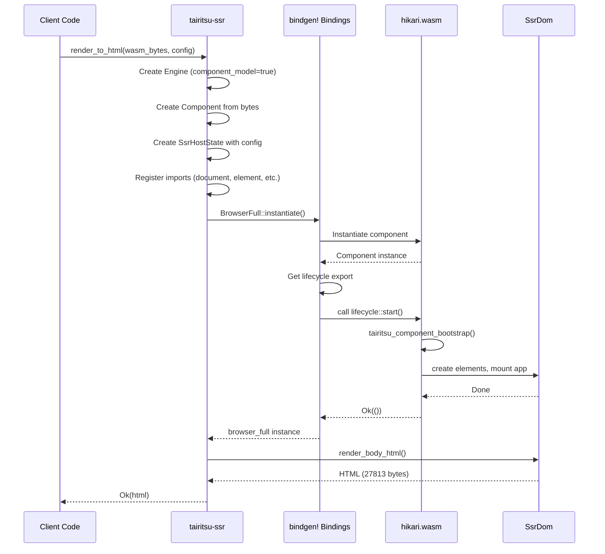

# Tairitsu SSR 集成规划

> **目标**：使 tairitsu-ssr 能加载 hikari 网站 `.wasm`，调用组件入口，将 in-memory DOM 序列化为完整 HTML，并通过 E2E 验证对接正确。

---

## 当前状态

- `packages/ssr` crate 已完成核心实现
- 公开 API 已就绪：`render_to_html(wasm_bytes, config)` / `render_full_page(...)`
- 核心 WIT 接口已手动实现：`document`、`node`、`element`、`style`、`console`、`window`、`platform-helpers`、`event-target`
- 435 个非核心 WIT 接口由 `build.rs` 自动生成 stub（返回默认值或无操作）
- in-memory DOM（`SsrDom`）+ HTML 序列化（`html_render.rs`）已实现
- ✅ 所有测试通过（包括 hikari website 集成测试，输出完整 27KB HTML）
- ✅ P0、P1、P2、P3 任务全部完成

---

## 已完成任务

### P0 — 联调 hikari 网站 wasm ✅ 已完成

**目标**：将 hikari 文档站编译产物 `website.wasm` 载入 `render_to_html()`，验证输出 HTML 正确。

**实现内容**：

- ✅ 添加 `platform-helpers` WIT 接口到 `browser-full.wit`
- ✅ 使用 `wasmtime::component::bindgen!` 生成类型安全的组件绑定
- ✅ 通过 `BrowserFull::instantiate()` 正确实例化组件
- ✅ 通过 `browser_full.tairitsu_browser_full_lifecycle().call_start()` 调用入口
- ✅ 输出完整 HTML（27813 字节），包含所有 hikari UI 组件

**成功标准**：`cargo test -p tairitsu-ssr -- test_hikari_website` 通过，输出包含 `#hikari-app`、`.hi-layout`、`.hikari-page` 的完整 HTML。

---

### P1 — 修复已知联调问题 ✅ 已完成

**验证结果**：

1. ✅ **WIT 类型映射**：`u64` handle ↔ WIT `u64` 的映射覆盖所有接口
2. ✅ **重复 map entry**：`register_all_auto_stubs` 中不存在已手动实现的接口被再次注册
3. ✅ **接口路径**：`tairitsu-browser:full/xxx@0.2.0` 命名空间与组件导入声明完全一致

---

### P2 — 完善 HTML 渲染质量 ✅ 已完成

**实现内容**：

- ✅ 添加了 `FullDocumentConfig` 结构体，包含 lang、charset、viewport、title、css_links 字段
- ✅ 实现了 `render_full_document_html()` 方法，生成完整的 HTML 文档
- ✅ 支持 `<!DOCTYPE html>` 声明
- ✅ 支持 `<html lang="...">` 属性
- ✅ 支持 `<head>` 内的 `<title>`、`<meta charset>`、`<meta name="viewport">`、CSS `<link>` 标签

**API 示例**：
```rust
use tairitsu_ssr::{SsrDom, FullDocumentConfig};

let config = FullDocumentConfig {
    lang: "zh-CN".to_string(),
    charset: "UTF-8".to_string(),
    viewport_content: "width=device-width, initial-scale=1.0".to_string(),
    title: "我的网站".to_string(),
    css_links: vec!["/styles/main.css".to_string()],
};

let html = dom.render_full_document_html(&config);
```

---

### P3 — Packager 集成（`tairitsu dev --ssr` / `tairitsu build --ssr`） ✅ 已完成

**实现内容**：

- ✅ `tairitsu dev --ssr` - SSR 开发服务器，支持实时渲染
- ✅ `tairitsu build --ssr` - 静态站点生成，预渲染 HTML
- ✅ 错误页面渲染和友好的错误消息
- ✅ SPA 回退支持（非根路径）
- ✅ 无缓存头支持
- ✅ 自动端口选择和浏览器自动打开

---

## 待完成任务

### P4 — Hydration 支持（长期）

当客户端 wasm 加载后，需要接管 SSR 服务端已输出的 DOM 节点，而非重新创建。

**需要的机制**：

- `tairitsu-web` 中新增 `mount_to_existing_dom()` 入口
- 服务端渲染时在 DOM 节点上打 `data-hk-*` marker，客户端按 marker 复用节点
- hikari 组件代码无需感知 SSR/CSR 区别

---

## 公开 API 约定（供 hikari 侧参考）

```rust
use tairitsu_ssr::{render_to_html, render_full_page, SsrConfig};

// 基本用法：获取 <body> 内 HTML
let html = render_to_html(&wasm_bytes, SsrConfig::default())?;

// 完整页面：注入到 index.html 模板
let page = render_full_page(&wasm_bytes, SsrConfig::default(), template_html)?;

// 自定义 viewport（影响 window.innerWidth 等接口返回值）
let cfg = SsrConfig::new(1280, 720);
let html = render_to_html(&wasm_bytes, cfg)?;
```

---

## 任务优先级

| 优先级 | 任务 | 状态 |
|--------|-----|------|
| P0 | 联调 hikari website.wasm | ✅ 已完成 |
| P1 | 修复 WIT 类型映射 / 重复注册问题 | ✅ 已完成 |
| P2 | 完善 HTML 渲染（完整 document 模式） | ✅ 已完成 |
| P3 | Packager `--ssr` 集成 | ✅ 已完成 |
| P4 | Hydration | 长期 |

---

## 验收标准

1. ✅ `cargo test -p tairitsu-ssr` 全部通过（含 hikari 联调测试）
2. ✅ `render_to_html(&hikari_wasm, default)` 返回包含完整 HTML（27813 字节）
3. ✅ 输出 HTML 包含所有 hikari UI 组件和内容

---

## 技术实现亮点

### 1. bindgen 宏的正确使用

使用 `wasmtime::component::bindgen!` 宏生成类型安全的 Rust 绑定，正确处理组件实例化和导出调用。

**关键代码**：
```rust
// bindings.rs
wasmtime::component::bindgen!({
    path: "../../packages/browser-worlds/wit",
    world: "browser-full",
});

// lib.rs - render_to_html()
let browser_full = BrowserFull::instantiate(&mut store, &component, &linker)?;
let lifecycle = browser_full.tairitsu_browser_full_lifecycle();
lifecycle.call_start(store)?;
```

### 2. 组件实例化时序图


