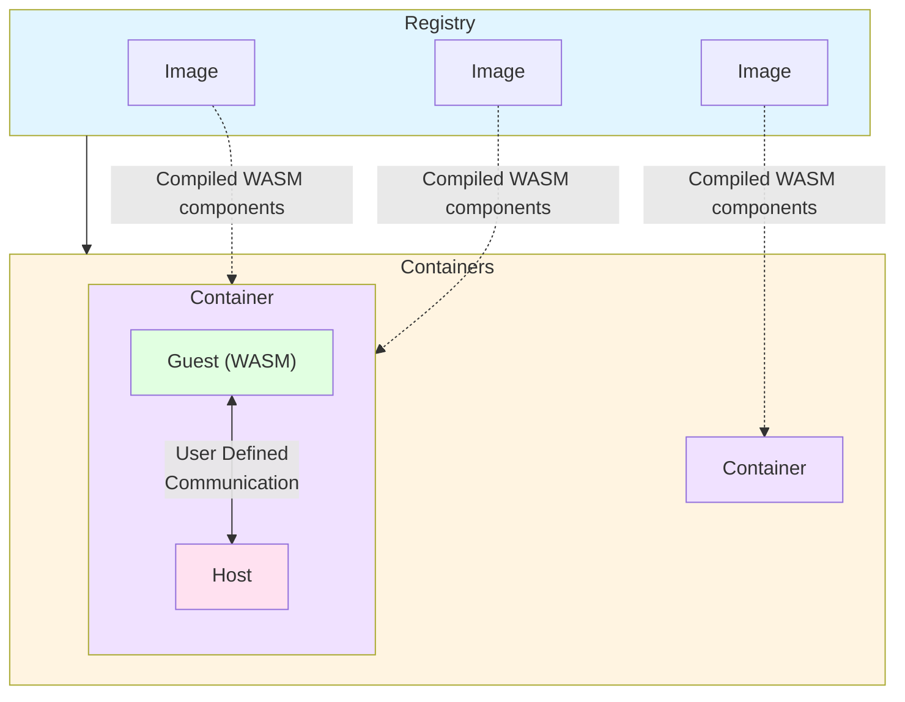

<div align="center"></div>
<h1 align="center">Tairitsu</h1>
<div align="center">
 <strong>
   Generic WASM Component Runtime Engine
 </strong>
</div>

<br />

<div align="center">
  <!-- CI status -->
  <a href="https://github.com/celestia-island/tairitsu/actions">
    
  </a>
  <!-- Built with -->
  <a href="https://github.com/casey/just">
    
  </a>
</div>

<div align="center">
  <h3>
    <a href="https://celestia.world">
      Website
    </a>
    <span> | </span>
    <a href="#quick-start">
      Quick Start
    </a>
  </h3>
</div>

<br/>

A WebAssembly runtime for running component-model based WASM modules.

## Features

- 🐳 **Docker-like Architecture**: Image/Container model for managing WASM modules
- 🔄 **Generic Runtime**: Does not prescribe any specific WIT interface - users define their own
- 🎯 **Flexible**: Builder pattern for custom WIT bindings and host state
- 🔌 **WIT-based**: Type-safe communication via WebAssembly Interface Types
- 🦀 **Pure Rust**: Built on Wasmtime with the Component Model
- 📦 **Macros**: Helper macros to reduce boilerplate

## Quick Start

This project uses [just](https://github.com/casey/just) as a build system.

### Run Examples

Tairitsu provides several examples demonstrating different approaches to WASM integration. Run them using `just`:

```bash
# Run comprehensive tests
just test
```

For all available commands and their descriptions, see the [justfile](justfile).

## Examples Overview

### 1. **wit-native-macro** - Macro-Assisted WIT Interface (Recommended)

The easiest way to define WIT interfaces using procedural macros:

**Features:**

- Zero boilerplate - automatic enum generation from WIT-like syntax
- Compile-time type safety with full IDE support
- No runtime serialization overhead
- Simple and intuitive API

```rust
wit_interface! {
    interface filesystem {
        read: func(path: String) -> Result<Vec<u8>, String>;
        write: func(path: String, data: Vec<u8>) -> Result<(), String>;
        delete: func(path: String) -> Result<(), String>;
        list: func(directory: String) -> Result<Vec<String>, String>;
    }
}
```

### 2. **wit-native-simple** - Trait-Based WIT Interface

Manual trait implementation for maximum flexibility:

**Features:**

- Full control over interface definitions
- Composable interfaces via traits
- Zero-cost abstractions
- Interface extension support

### 3. **wit-dynamic** - Dynamic JSON Invocation

Fully dynamic function calls with JSON serialization:

**Features:**

- Runtime function discovery
- Type-safe tool wrapping
- Tool registry for dynamic management
- RPC and plugin system support

### 4. **wit-compile-time** - Compile-Time WIT Binding

Static WIT binding with wasmtime bindgen:

**Features:**

- Complete compile-time type checking
- Zero runtime overhead
- Best performance
- IDE autocomplete support

### 5. **wit-runtime** - Runtime WIT Loading

Dynamic WIT definition loading:

**Features:**

- Runtime WIT discovery
- Interface validation
- Plugin system support
- Capability negotiation

See [examples/README.md](examples/README.md) for detailed documentation of each example.

### Choosing the Right Approach

| Approach | Type Safety | Performance | Flexibility | Best For |
| :--- | :--- | :--- | :--- | :--- |
| **Macro** | Full | Best | Medium | Most use cases |
| **Trait** | Full | Best | High | Complex interfaces |
| **Dynamic JSON** | Runtime | Medium | Highest | APIs, RPC |
| **Compile-time** | Full | Best | Low | Fixed interfaces |
| **Runtime** | Partial | Good | High | Plugin systems |

### Basic Usage

```rust,no_run
use tairitsu::{Container, Image, HostState};
use bytes::Bytes;

// 1. Create a WASM image
let wasm_binary = std::fs::read("component.wasm")?;
let image = Image::new(Bytes::from(wasm_binary))?;

// 2. Create container with your WIT bindings
let container = Container::builder(image)?
    .with_guest_initializer(|ctx| {
        // Register your WIT interface (generated by wit-bindgen)
        MyWit::add_to_linker(ctx.linker, |state| &mut state.my_data)?;

        // Instantiate the component
        let instance = MyWit::instantiate(
            ctx.store,
            ctx.component,
            ctx.linker
        )?;

        Ok(GuestInstance::new(instance))
    })?
    .build()?;

// 3. Use the container to call into WASM
let guest = container.guest().downcast_ref::<MyWit>()?;
let result = guest.my_function(ctx.store)?;
```

## Architecture

Tairitsu is a **generic WASM runtime engine** - it does not prescribe any specific WIT interface:



### Core Concepts

- **Registry**: Manages WASM images and running containers (like Docker daemon)
- **Image**: A compiled WASM component that can be instantiated (like Docker image)
- **Container**: A running instance with user-defined WIT bindings
- **WIT Bindings**: Users define their own WIT interfaces using `wit-bindgen`

### Defining Your WIT Interface

1. Create a `.wit` file:

```wit
interface my-app {
    greet: func(name: string) -> string;
    compute: func(input: string) -> string;
}
```

1. Generate bindings with `wit-bindgen`:

```bash
wit-bindgen rust --world my-app
```

1. Use the generated bindings with Tairitsu:

```rust
use tairitsu::Container;

let container = Container::builder(image)?
    .with_guest_initializer(|ctx| {
        // Use the generated bindings
        MyApp::add_to_linker(ctx.linker, |state| &mut state.data)?;
        let instance = MyApp::instantiate(ctx.store, ctx.component, ctx.linker)?;
        Ok(GuestInstance::new(instance))
    })?
    .build()?;
```

## Helper Macros

Tairitsu provides macros to reduce boilerplate:

### `impl_wit_interface!`

Quickly implement the `WitInterface` trait:

```rust
impl_wit_interface!(MyInterface, "my-interface",
    fn register_handlers(&self, dispatcher: &mut WitCommandDispatcher) {
        dispatcher.register("my-command", Box::new(my_handler));
    }
);
```

### `simple_handler!`

Create stateless handlers:

```rust
let handler = simple_handler!(MyCommand, |cmd| {
    match cmd {
        MyCommand::Foo => Ok(()),
    }
});
```

### `stateful_handler!`

Create handlers with state:

```rust
let handler = stateful_handler!(MyState, MyCommand, |state, cmd| {
    state.counter += 1;
    Ok(state.counter)
});
```

## Advanced Usage

### Type-Safe Commands with Zero Serialization

The native approaches (`wit-native-*`) provide compile-time type safety without runtime serialization overhead:

```rust
use tairitsu::{WitCommand, WitCommandHandler, WitCommandDispatcher};

// Define your command types
#[derive(Debug, Clone)]
pub enum MyCommands {
    Process { input: String },
    Query { id: u32 },
}

impl WitCommand for MyCommands {
    type Response = Result<String, String>;

    fn command_name(&self) -> &'static str {
        match self {
            Self::Process { .. } => "process",
            Self::Query { .. } => "query",
        }
    }

    fn as_any(&self) -> &dyn std::any::Any {
        self
    }
}

// Implement handler
struct MyHandler;

impl WitCommandHandler<MyCommands> for MyHandler {
    fn execute(
        &mut self,
        command: &MyCommands,
    ) -> Result<MyCommands::Response, String> {
        match command {
            MyCommands::Process { input } => {
                Ok(Ok(format!("Processed: {}", input)))
            }
            MyCommands::Query { id } => {
                Ok(Ok(format!("Query result for {}", id)))
            }
        }
    }
}
```

### Dynamic JSON Invocation

For scenarios requiring runtime flexibility, use the JSON-based approach:

```rust
use tairitsu::{json::Tool, ToolRegistry, typed_tool};
use serde::{Deserialize, Serialize};

#[derive(Deserialize)]
struct MyInput {
    param: String,
}

#[derive(Serialize)]
struct MyOutput {
    result: String,
}

// Create a type-safe tool
let tool = typed_tool("my-function", |input: MyInput| -> MyOutput {
    MyOutput {
        result: format!("Processed: {}", input.param),
    }
});

// Register and invoke
let mut registry = ToolRegistry::new();
registry.register("my-function".to_string(), tool);

let result = registry.invoke("my-function", r#"{"param":"test"}"#)?;
```

### Composable Interfaces

Use trait objects to compose multiple WIT interfaces:

```rust
use tairitsu::{CompositeWitInterface, WitInterface};

struct FileSystemInterface;
impl WitInterface for FileSystemInterface {
    fn interface_name(&self) -> &'static str {
        "filesystem"
    }

    fn register_handlers(&self, dispatcher: &mut WitCommandDispatcher) {
        // Register handlers
    }
}

struct NetworkInterface;
impl WitInterface for NetworkInterface {
    fn interface_name(&self) -> &'static str {
        "network"
    }

    fn register_handlers(&self, dispatcher: &mut WitCommandDispatcher) {
        // Register handlers
    }
}

// Compose multiple interfaces
let mut composite = CompositeWitInterface::new();
composite.add_interface(Box::new(FileSystemInterface));
composite.add_interface(Box::new(NetworkInterface));

// Register all at once
let mut dispatcher = WitCommandDispatcher::new();
composite.register_all(&mut dispatcher);
```

## Design Philosophy

Tairitsu is designed to be a **pure engine** - it provides:

- ✅ Generic WASM container runtime
- ✅ Image/Registry management
- ✅ Builder pattern for WIT bindings
- ✅ Helper macros to reduce boilerplate

It does **not** prescribe:

- ❌ Specific WIT interfaces (you define your own)
- ❌ Command types (you define your own)
- ❌ Serialization format (use WIT)

This makes Tairitsu suitable for **any** WASM component-based application.

## Architecture Trade-offs

### Native vs Dynamic Approaches

**Native (Trait-based)** - Use when:

- You control both host and guest code
- Performance is critical
- Type safety is a priority
- Building a closed system

**Dynamic (JSON-based)** - Use when:

- Building HTTP APIs or RPC servers
- Integrating with external systems
- Runtime function discovery needed
- Flexibility is more important than performance

### When to Use Each Approach

#### Macro Approach (`wit-native-macro`)

- ✅ Quick development with minimal boilerplate
- ✅ Best for most applications
- ✅ Easy to maintain and refactor
- ❌ Less control than manual trait implementation

#### Manual Trait Approach (`wit-native-simple`)

- ✅ Maximum flexibility and control
- ✅ Best for complex interface hierarchies
- ✅ Can optimize for specific use cases
- ❌ More boilerplate to maintain

#### Dynamic JSON Approach (`wit-dynamic`)

- ✅ Ideal for API servers and RPC
- ✅ Supports runtime discovery
- ✅ Language-agnostic integration
- ❌ Runtime serialization overhead
- ❌ Loses compile-time type checking

## Best Practices

1. **Start with the macro approach** - It's the easiest way to get started
2. **Use traits for composition** - Combine multiple interfaces using `CompositeWitInterface`
3. **Prefer native approaches** - Only use dynamic JSON when necessary
4. **Define clear interfaces** - Well-designed WIT interfaces make your system more maintainable
5. **Test in isolation** - Test handlers independently before integrating with WASM

## What is Tairitsu?

**Tairitsu** (対立) carries a dual meaning:

1. **From Arcaea**: Named after the character Tairitsu from the rhythm game Arcaea, representing the "Conflict" side
2. **Opposition & Duality**: Reflects the architectural concept of this framework - the inherent duality and opposition between the WASM virtual machine (guest) and the host environment, connected through WIT (WebAssembly Interface Types)

## License

See [LICENSE](LICENSE) for details.
