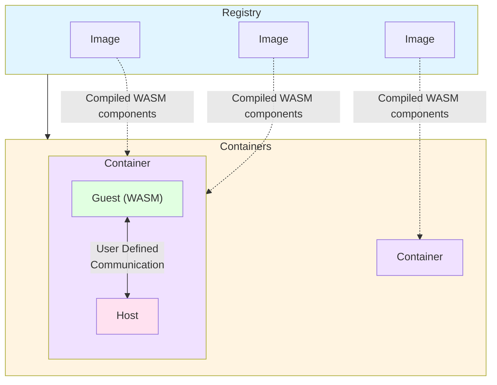

<div align="center"></div>
<h1 align="center">Tairitsu</h1>
<div align="center">
 <strong>
   Generic WASM Component Runtime Engine
 </strong>
</div>

<br />

<div align="center">
  <!-- CI status -->
  <a href="https://github.com/celestia-island/tairitsu/actions">
    
  </a>
  <!-- Built with -->
  <a href="https://github.com/casey/just">
    
  </a>
</div>

<div align="center">
  <h3>
    <a href="https://celestia.world">
      Website
    </a>
    <span> | </span>
    <a href="#quick-start">
      Quick Start
    </a>
  </h3>
</div>

<br/>

## Features

- 🐳 **Docker-like Architecture**: Image/Container model for managing WASM modules
- 🔄 **Generic Runtime**: Does not prescribe any specific WIT interface - users define their own
- 🎯 **Flexible**: Builder pattern for custom WIT bindings and host state
- 🔌 **WIT-based**: Type-safe communication via WebAssembly Interface Types
- 🦀 **Pure Rust**: Built on Wasmtime with the Component Model
- 📦 **Macros**: Helper macros to reduce boilerplate

## Quick Start

### Run the Minimal Example

```bash
cargo run --package tairitsu-minimal-example
```

### Basic Usage

```rust,no_run
use tairitsu::{Container, Image, HostState};
use bytes::Bytes;

// 1. Create a WASM image
let wasm_binary = std::fs::read("component.wasm")?;
let image = Image::new(Bytes::from(wasm_binary))?;

// 2. Create container with your WIT bindings
let container = Container::builder(image)?
    .with_guest_initializer(|ctx| {
        // Register your WIT interface (generated by wit-bindgen)
        MyWit::add_to_linker(ctx.linker, |state| &mut state.my_data)?;

        // Instantiate the component
        let instance = MyWit::instantiate(
            ctx.store,
            ctx.component,
            ctx.linker
        )?;

        Ok(GuestInstance::new(instance))
    })?
    .build()?;

// 3. Use the container to call into WASM
let guest = container.guest().downcast_ref::<MyWit>()?;
let result = guest.my_function(ctx.store)?;
```

## Architecture

Tairitsu is a **generic WASM runtime engine** - it does not prescribe any specific WIT interface:



### Core Concepts

- **Registry**: Manages WASM images and running containers (like Docker daemon)
- **Image**: A compiled WASM component that can be instantiated (like Docker image)
- **Container**: A running instance with user-defined WIT bindings
- **WIT Bindings**: Users define their own WIT interfaces using `wit-bindgen`

### Defining Your WIT Interface

1. Create a `.wit` file:

```wit
interface my-app {
    greet: func(name: string) -> string;
    compute: func(input: string) -> string;
}
```

1. Generate bindings with `wit-bindgen`:

```bash
wit-bindgen rust --world my-app
```

1. Use the generated bindings with Tairitsu:

```rust
use tairitsu::Container;

let container = Container::builder(image)?
    .with_guest_initializer(|ctx| {
        // Use the generated bindings
        MyApp::add_to_linker(ctx.linker, |state| &mut state.data)?;
        let instance = MyApp::instantiate(ctx.store, ctx.component, ctx.linker)?;
        Ok(GuestInstance::new(instance))
    })?
    .build()?;
```

## Helper Macros

Tairitsu provides macros to reduce boilerplate:

### `impl_wit_interface!`

Quickly implement the `WitInterface` trait:

```rust
impl_wit_interface!(MyInterface, "my-interface",
    fn register_handlers(&self, dispatcher: &mut WitCommandDispatcher) {
        dispatcher.register("my-command", Box::new(my_handler));
    }
);
```

### `simple_handler!`

Create stateless handlers:

```rust
let handler = simple_handler!(MyCommand, |cmd| {
    match cmd {
        MyCommand::Foo => Ok(()),
    }
});
```

### `stateful_handler!`

Create handlers with state:

```rust
let handler = stateful_handler!(MyState, MyCommand, |state, cmd| {
    state.counter += 1;
    Ok(state.counter)
});
```

## Design Philosophy

Tairitsu is designed to be a **pure engine** - it provides:

- ✅ Generic WASM container runtime
- ✅ Image/Registry management
- ✅ Builder pattern for WIT bindings
- ✅ Helper macros to reduce boilerplate

It does **not** prescribe:

- ❌ Specific WIT interfaces (you define your own)
- ❌ Command types (you define your own)
- ❌ Serialization format (use WIT)

This makes Tairitsu suitable for **any** WASM component-based application.

## What is Tairitsu?

**Tairitsu** (対立) carries a dual meaning:

1. **From Arcaea**: Named after the character Tairitsu from the rhythm game Arcaea, representing the "Conflict" side
2. **Opposition & Duality**: Reflects the architectural concept of this framework - the inherent duality and opposition between the WASM virtual machine (guest) and the host environment, connected through WIT (WebAssembly Interface Types)

## License

See [LICENSE](LICENSE) for details.
