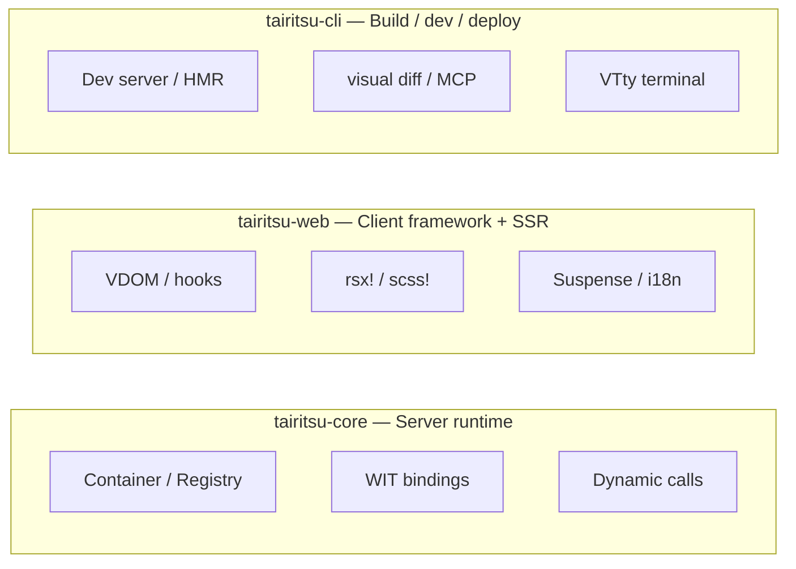
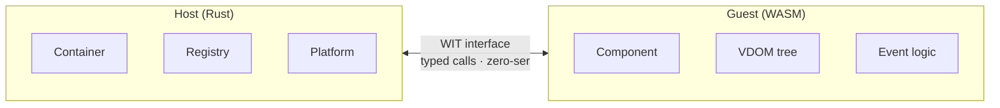

# Tairitsu

**Full-stack framework powered by the WASM Component Model.** Write components once, run them anywhere — server, browser, edge. All communication typed via WIT.

---

## Why Tairitsu?

Tairitsu unifies two worlds that are typically separate:

| Traditional stack | Tairitsu |
|:--|:--|
| Backend: Node/Go/Rust server | Container runtime (native wasmtime) |
| Frontend: React/Vue/Svelte | VDOM + hooks — compiled to `wasm32-wasip2` |
| Protocol: REST/GraphQL/JSON | WIT interfaces: typed at compile time, zero serialization |
| Build: Webpack/Vite/Trunk | `tairitsu dev` / `tairitsu build` — one tool for both targets |
| Deploy: Docker + CDN | `tairitsu deploy` — push to Registry, serve anywhere |

**The same WASM component** talks to a server database, renders HTML via SSR, and handles browser DOM events — all through a single WIT interface definition.

---

## Three Faces of Tairitsu


```mermaid
graph LR
    subgraph CORE["tairitsu-core — Server runtime"]
        C1["Container / Registry"]
        C2["WIT bindings"]
        C3["Dynamic calls"]
    end
    subgraph WEB["tairitsu-web — Client framework + SSR"]
        W1["VDOM / hooks"]
        W2["rsx! / scss!"]
        W3["Suspense / i18n"]
    end
    subgraph CLI["tairitsu-cli — Build / dev / deploy"]
        X1["Dev server / HMR"]
        X2["visual diff / MCP"]
        X3["VTty terminal"]
    end
```

---

## Quick Start

```bash
# Install the CLI
cargo install tairitsu-packager

# Create a project
tairitsu new my-app
cd my-app

# Start dev server (hot reload, browser VDOM)
tairitsu dev

# Build for production
tairitsu build
```

Open `http://localhost:3000`.

---

## A Component in 30 Seconds

```rust
use tairitsu_macros::{component, rsx};
use tairitsu_vdom::{VNode, Signal};

#[component]
fn Counter(initial: i32) -> VNode {
    let count = Signal::new(initial);

    rsx! {
        div {
            button {
                onclick: move |_| count.set(count.get() + 1),
                "Clicked: "
                ..txt(&count.get().to_string())
            }
        }
    }
}
```

Same component, two execution paths:
- **Browser**: `tairitsu dev` — renders with real DOM, handles click events
- **Server**: `tairitsu serve` — renders to HTML string via SSR

---

## Architecture


```mermaid
graph LR
    subgraph HOST["Host (Rust)"]
        H1["Container"]
        H2["Registry"]
        H3["Platform"]
    end
    subgraph GUEST["Guest (WASM)"]
        G1["Component"]
        G2["VDOM tree"]
        G3["Event logic"]
    end
    HOST <-->|"WIT interface<br/>typed calls · zero-ser"| GUEST
```

---

## Features

- **WIT-native**: No wasm-bindgen. Full Component Model with type-safe interface definitions
- **Docker-like runtime**: Image → Container → Registry lifecycle for WASM components
- **VDOM + hooks**: React-like DX with `rsx!` macro, signals, effects, suspense
- **Compile-time CSS**: `scss!` macro with class hashing (CSS Modules) and source maps
- **Safe SVG**: `svg!` macro with XSS sanitization at compile time
- **SSR + streaming**: Server-side rendering with HMR, fast refresh, error overlay
- **Dual backends**: `WitPlatform` (WIT bindings) and `WebPlatform` (web-sys) side by side
- **W3C coverage**: 50+ WebIDL specs → generated WIT interfaces → TypeScript glue
- **Visual regression**: Pixel diff testing with Chromium automation
- **MCP server**: AI agent integration via Model Context Protocol
- **Desktop packaging**: Bundle as native app (Wry/Tao)

---

## Documentation

- [Guides](docs/en/guides/index.md) — tutorials, quick start, migration
- [System Architecture](docs/en/system/overview.md) — runtime model, WIT pipeline, backends
- [Package Map](docs/en/components/index.md) — workspace crate hierarchy

---

## Compared to...

|  | Tairitsu | Leptos | Dioxus | wasmCloud |
|:--|:--|:--|:--|:--|
| Paradigm | VDOM | Fine-grained reactive | VDOM | Actor/Lattice |
| WASM model | Component Model | wasm-bindgen | wasm-bindgen | Component Model |
| Server runtime | Built-in Container | Server functions | Server functions | Full platform |
| SSR | Streaming + HMR | In-order + streaming | Static + hydration | N/A |
| Browser binding | WIT (WebIDL→WIT) | web-sys | web-sys | N/A |
| Deploy target | Any wasmtime host | WASM server | WASM server | Distributed cluster |
| CSS | scss! macro | Stylers (Rust) | Stylers (Rust) | N/A |

---

## License

MIT OR Apache-2.0
