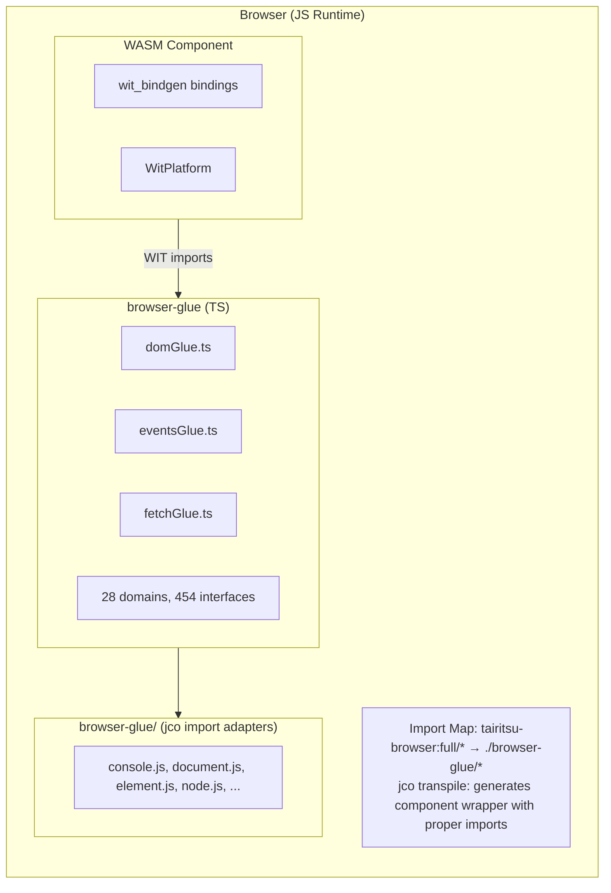

# بنية Browser Glue

توفر حزمة browser-glue تطبيقات TypeScript لواجهات WIT الخاصة بـ `tairitsu-browser:full`، مما يمكّن مكونات WebAssembly من التفاعل مع واجهات برمجة تطبيقات المتصفح من خلال نموذج المكونات.

## نظرة عامة على البنية



## المكونات الرئيسية

### TypeScript Glue (`src/*.ts`)

تطبيقات TypeScript مُولّدة تلقائياً لواجهات WIT:

| النطاق | الملف | الواجهات | الدوال |
|--------|-------|----------|--------|
| DOM | `domGlue.ts` | 34 | ~300 |
| HTML | `htmlGlue.ts` | 182 | ~1500 |
| CSS | `cssGlue.ts` | 44 | ~400 |
| Canvas | `canvasGlue.ts` | 20 | ~200 |
| Fetch | `fetchGlue.ts` | 25 | ~150 |
| Events | `eventsGlue.ts` | 15 | ~100 |
| ... | ... | ... | ... |

### ملفات تعريف الأنواع (`dist/*.d.ts`)

ملفات تعريف TypeScript لدعم IDE وفحص الأنواع.

### غلافات الواجهات (`dist/browser-glue/*.js`)

ملفات محولات بسيطة لاستيرادات jco المحوّلة:

- `console.js` - واجهة التسجيل
- `document.js` - إنشاء المستند
- `element.js` - سمات العناصر
- `node.js` - عمليات شجرة DOM
- `style.js` - خصائص نمط CSS
- `event-target.js` - مستمعي الأحداث
- `non-element-parent-node.js` - getElementById
- `window.js` - أبعاد النافذة

## التكامل مع jco

### تكوين خريطة الاستيراد

```html
<script type="importmap">
{
  "imports": {
    "@bytecodealliance/preview2-shim/": "https://esm.sh/@bytecodealliance/preview2-shim/",
    "tairitsu-browser:full/": "./browser-glue/"
  }
}
</script>
```

### عملية التحويل (Transpile)

1. بناء مكون WASM: `cargo build --target wasm32-wasip2 --lib --release`
2. التحويل باستخدام jco: `jco transpile component.wasm -o output/`
3. jco يُنشئ غلافاً مع الاستيرادات من `tairitsu-browser:full/*`
4. خريطة الاستيراد تحل إلى محولات `./browser-glue/*`

## نظام المقابض (Handle System)

تُمثَّل كائنات المتصفح كمقابض معتمة `u64`:

```typescript
// جانب TypeScript
const element = document.createElement('div');
const handle = registerHandle(element); // يُرجع bigint

// جانب Rust يستقبل u64
let handle: u64 = bindings::document::create_element("div", None);
```

### جدول المقابض (`handles.ts`)

```typescript
const _handles = new Map<bigint, object>();
let _nextHandle = 1n;

export function registerHandle(obj: object): bigint {
  const handle = BigInt(_nextHandle++);
  _handles.set(handle, obj);
  return handle;
}

export function lookupHandle<T>(handle: bigint): T | null {
  return _handles.get(handle) as T ?? null;
}
```

## عملية البناء

```bash
# إعادة توليد الـ glue من WIT
python3 scripts/generate_browser_glue.py

# البناء مع التعريفات
cd packages/browser-glue && npm run build

# بناء الإنتاج مع التصغير
npm run build:production
```

## هيكل الحزمة

```mermaid
graph TD
    ROOT["packages/browser-glue/"] --> SRC["src/"]
    ROOT --> DIST["dist/"]
    ROOT --> PKG["package.json"]
    SRC --> S1["index.ts — نقطة الدخول الرئيسية"]
    SRC --> S2["handles.ts — إدارة المقابض"]
    SRC --> S3["async.ts — أدوات غير متزامنة"]
    SRC --> S4["consoleGlue.ts — واجهة الطرفية"]
    SRC --> S5["styleGlue.ts — واجهة النمط"]
    SRC --> S6["eventTargetGlue.ts — هدف الحدث"]
    SRC --> S7["domGlue.ts — عمليات DOM"]
    SRC --> S8["eventsGlue.ts — أنواع الأحداث"]
    SRC --> S9["fetchGlue.ts — Fetch API"]
    SRC --> S10["canvasGlue.ts — Canvas 2D"]
    SRC --> S11["... (28 نطاقاً)"]
    DIST --> D1["index.js — نقطة الدخول المُجمّعة"]
    DIST --> D2["*.d.ts — تعريفات الأنواع"]
    DIST --> D3["browser-glue/ — محولات jco"]
```


