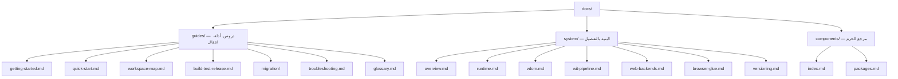

# توثيق Tairitsu

Tairitsu هو إطار عمل متكامل يعتمد على نموذج مكونات WASM. اكتب المكونات مرة واحدة وشغّلها في أي مكان — الخادم، المتصفح، أو الحافة. جميع الاتصالات مُنمطة عبر WIT.

## اختر مسارك

| أريد... | ابدأ هنا |
|:--|:--|
| التجربة في 5 دقائق | [البدء السريع](guides/quick-start.md) |
| التعلم من الصفر | [دليل المبتدئين](guides/getting-started.md) |
| فهم البنية | [نظرة عامة على النظام](system/overview.md) |
| عرض جميع الحزم | [خريطة الحزم](components/index.md) |
| الانتقال من Dioxus | [دليل الانتقال](guides/migration/dioxus-to-tairitsu.md) |
| حل مشكلة | [استكشاف الأخطاء](guides/troubleshooting.md) |
| تصفح مساحة العمل | [خريطة مساحة العمل](guides/workspace-map.md) |
| البحث عن مصطلح | [المسرد](guides/glossary.md) |

## هيكل التوثيق

## لغات أخرى

- [English](../en/index.md)
- [简体中文](../zhs/index.md)
- [繁體中文](../zht/index.md)
- [日本語](../ja/index.md)
- [한국어](../ko/index.md)
- [Español](../es/index.md)
- [Français](../fr/index.md)
- [Русский](../ru/index.md)
