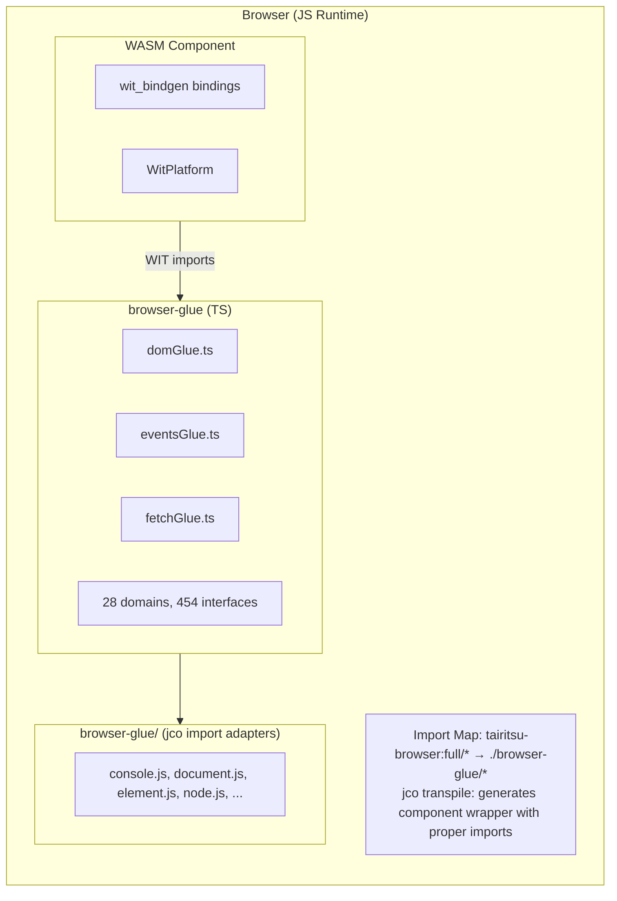

# Browser Glue Architecture

The browser-glue package provides TypeScript implementations of the `tairitsu-browser:full` WIT interfaces, enabling WebAssembly components to interact with browser APIs through the Component Model.

## Architecture Overview



## Key Components

### TypeScript Glue (`src/*.ts`)

Auto-generated TypeScript implementations of WIT interfaces:

| Domain | File | Interfaces | Functions |
|--------|------|------------|-----------|
| DOM | `domGlue.ts` | 34 | ~300 |
| HTML | `htmlGlue.ts` | 182 | ~1500 |
| CSS | `cssGlue.ts` | 44 | ~400 |
| Canvas | `canvasGlue.ts` | 20 | ~200 |
| Fetch | `fetchGlue.ts` | 25 | ~150 |
| Events | `eventsGlue.ts` | 15 | ~100 |
| ... | ... | ... | ... |

### Type Declarations (`dist/*.d.ts`)

TypeScript declaration files for IDE support and type checking.

### Interface Wrappers (`dist/browser-glue/*.js`)

Minimal adapter files for jco transpiled imports:

- `console.js` - Logging interface
- `document.js` - Document creation
- `element.js` - Element attributes
- `node.js` - DOM tree operations
- `style.js` - CSS style properties
- `event-target.js` - Event listeners
- `non-element-parent-node.js` - getElementById
- `window.js` - Window dimensions

## jco Integration

### Import Map Configuration

```html
<script type="importmap">
{
  "imports": {
    "@bytecodealliance/preview2-shim/": "https://esm.sh/@bytecodealliance/preview2-shim/",
    "tairitsu-browser:full/": "./browser-glue/"
  }
}
</script>
```

### Transpile Process

1. Build WASM component: `cargo build --target wasm32-wasip2 --lib --release`
2. Transpile with jco: `jco transpile component.wasm -o output/`
3. jco generates wrapper with imports from `tairitsu-browser:full/*`
4. Import map resolves to `./browser-glue/*` adapters

## Handle System

Browser objects are represented as opaque `u64` handles:

```typescript
// TypeScript side
const element = document.createElement('div');
const handle = registerHandle(element); // Returns bigint

// Rust side receives u64
let handle: u64 = bindings::document::create_element("div", None);
```

### Handle Table (`handles.ts`)

```typescript
const _handles = new Map<bigint, object>();
let _nextHandle = 1n;

export function registerHandle(obj: object): bigint {
  const handle = BigInt(_nextHandle++);
  _handles.set(handle, obj);
  return handle;
}

export function lookupHandle<T>(handle: bigint): T | null {
  return _handles.get(handle) as T ?? null;
}
```

## Build Process

```bash
# Regenerate glue from WIT
python3 scripts/generate_browser_glue.py

# Build with declarations
cd packages/browser-glue && npm run build

# Production build with minification
npm run build:production
```

## Package Layout

```mermaid
graph TD
    ROOT["packages/browser-glue/"] --> SRC["src/"]
    ROOT --> DIST["dist/"]
    ROOT --> PKG["package.json"]
    SRC --> S1["index.ts — Main entry"]
    SRC --> S2["handles.ts — Handle management"]
    SRC --> S3["async.ts — Async utilities"]
    SRC --> S4["consoleGlue.ts — Console interface"]
    SRC --> S5["styleGlue.ts — Style interface"]
    SRC --> S6["eventTargetGlue.ts — Event target"]
    SRC --> S7["domGlue.ts — DOM operations"]
    SRC --> S8["eventsGlue.ts — Event types"]
    SRC --> S9["fetchGlue.ts — Fetch API"]
    SRC --> S10["canvasGlue.ts — Canvas 2D"]
    SRC --> S11["... (28 domains)"]
    DIST --> D1["index.js — Compiled entry"]
    DIST --> D2["*.d.ts — Type declarations"]
    DIST --> D3["browser-glue/ — jco adapters"]
```


