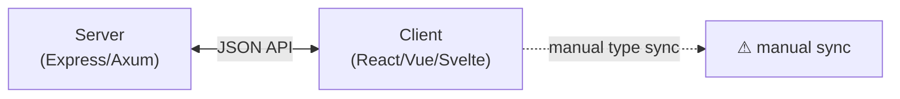
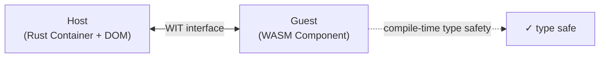

# Getting Started

This tutorial walks you through building a full-stack application with Tairitsu. You'll learn how a single WASM component can run both in the browser and on the server.

## What You'll Build

A simple single-page guestbook application — server-side rendering with client-side interactivity.

## Table of Contents

1. [Why Tairitsu?](#why-tairitsu)
2. [Installation](#installation)
3. [Your First Component](#your-first-component)
4. [Adding State with Signals](#adding-state-with-signals)
5. [Defining a WIT Interface](#defining-a-wit-interface)
6. [Running in the Browser](#running-in-the-browser)
7. [Server-Side Rendering](#server-side-rendering)
8. [Deploying to a Registry](#deploying-to-a-registry)
9. [Where to Go Next](#where-to-go-next)

---

## Why Tairitsu?

Traditional web frameworks keep server and client as separate concerns:



Tairitsu uses the WASM Component Model to define a **single WIT interface** that both sides implement:



The same component renders HTML on the server **and** handles click events in the browser — through the same typed interface.

---

## Installation

```bash
# Install Rust
curl --proto '=https' --tlsv1.2 -sSf https://sh.rustup.rs | sh

# Install just (task runner)
cargo install just

# Install the WASM target
rustup target add wasm32-wasip2

# Build and install the Tairitsu CLI
git clone https://github.com/celestia-island/tairitsu
cd tairitsu
just install-packager

# Verify
tairitsu --version
```

---

## Your First Component

Create a new project:

```bash
tairitsu new hello-world
cd hello-world
```

Edit `src/lib.rs`:

```rust
use tairitsu_macros::{component, rsx};
use tairitsu_vdom::VNode;

#[component]
fn App() -> VNode {
    rsx! {
        div {
            class: "container",
            h1 { "Hello, Tairitsu!" }
            p { "My first WASM component." }
        }
    }
}
```

Start the dev server:

```bash
tairitsu dev
```

Open `http://localhost:3000`. You'll see your component rendered in the browser.

### What's Happening Under the Hood

1. The Rust code is compiled to `wasm32-wasip2` as a WASM component
2. `tairitsu dev` starts an axum server that instantiates the component
3. The component renders its VDOM tree
4. browser-glue bridges WIT ABI calls to real DOM operations
5. The browser displays the HTML

---

## Adding State with Signals

Tairitsu uses Signals for reactive state — similar to SolidJS or Leptos.

```rust
use tairitsu_macros::{component, rsx};
use tairitsu_vdom::{VNode, Signal};

#[component]
fn Counter() -> VNode {
    let count = Signal::new(0);

    let count_clone = count.clone();
    let increment = move |_| {
        let c = count_clone.get();
        count_clone.set(c + 1);
    };

    let count_display = count.clone();
    rsx! {
        div {
            h2 { "Counter" }
            p { ..txt(&format!("Current count: {}", count_display.get())) }
            button {
                onclick: increment,
                "+1"
            }
            button {
                onclick: move |_| {
                    let c = count.get();
                    count.set(c - 1);
                },
                "-1"
            }
        }
    }
}

fn txt(text: &str) -> Vec<VNode> {
    vec![tairitsu_vdom::VNode::Text(tairitsu_vdom::VText::new(text))]
}
```

Key concepts:
- `Signal::new(value)` — create reactive state
- `signal.get()` — read current value (subscribes to changes)
- `signal.set(new_value)` — update value (triggers re-render)
- `signal.clone()` — cheap Arc-based clone for sharing across closures

### Effects

React to signal changes:

```rust
use tairitsu_vdom::create_effect;

let count = Signal::new(0);
let count_clone = count.clone();

create_effect(move || {
    let c = count_clone.get();
    gloo_utils::log(&format!("count changed to {}", c));
});
```

---

## Defining a WIT Interface

WIT (WebAssembly Interface Types) defines the contract between your component and the host:

```wit
// wit/guestbook.wit
interface guestbook {
    record entry {
        id: u32,
        name: string,
        message: string,
    }

    list-entries: func() -> result<list<entry>, string>;
    add-entry: func(name: string, message: string) -> result<entry, string>;
}
```

Use `wit_interface!` to generate Rust bindings:

```rust
use tairitsu::wit_interface;

wit_interface! {
    interface guestbook {
        list_entries: func() -> Result<Vec<Entry>, String>;
        add_entry: func(name: String, message: String) -> Result<Entry, String>;
    }
}
```

---

## Running in the Browser

For browser-only execution (no server):

```bash
tairitsu dev --target browser
```

Your component runs entirely client-side. Uses the `WebPlatform` backend (web-sys) for DOM operations.

---

## Server-Side Rendering

For production SSR:

```bash
tairitsu build
tairitsu serve
```

The component renders to HTML on the server, sends it to the browser, then hydrates for interactivity. The same component code handles both phases.

### Streaming SSR

Enable streaming for progressive HTML delivery:

```toml
# Cargo.toml
[dependencies]
tairitsu-ssr = { features = ["streaming"] }
```

```rust
// Server streams HTML as it renders
app.render_to_stream().await
```

---

## Deploying to a Registry

Build and push your component:

```bash
tairitsu build --release
tairitsu push my-app:1.0.0
```

On any wasmtime-compatible host:

```rust
use tairitsu::{Registry, Image};

let mut registry = Registry::new();
registry.pull("my-app:1.0.0").await?;
let container = registry.run("my-app")?;

// Call into the component dynamically
let result = container.call_guest_raw_desc(
    "list-entries",
    "()"
)?;
```

---

## Where to Go Next

| Topic | Document |
|:--|:--|
| All hooks (use_memo, use_resource, Suspense) | [hooks API](../components/packages.md#tairitsu-hooks) |
| Styling with `scss!` macro | [style crate](../components/packages.md#tairitsu-style) |
| Routing | [Router module](../components/packages.md#tairitsu-web) |
| WIT pipeline internals | [WIT Pipeline](../system/wit-pipeline.md) |
| Debugging with MCP | [Debug Agent](../skills/debug-agent.md) |
