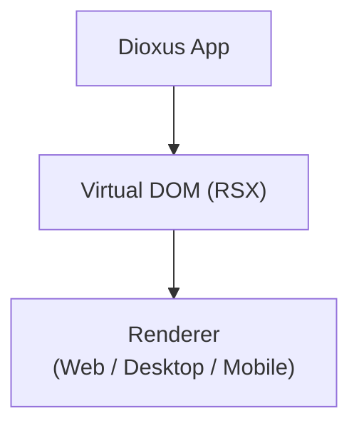
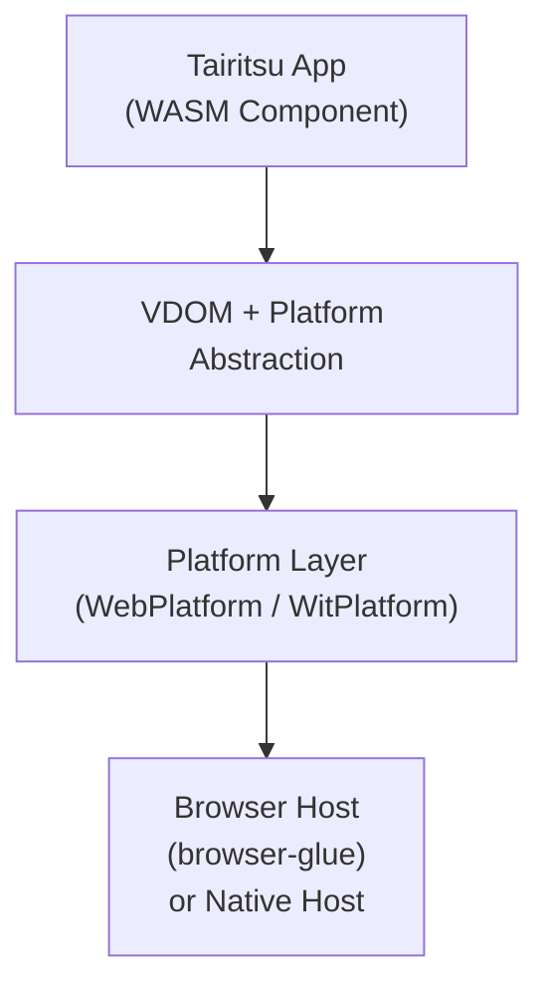

# Migrating from Dioxus to Tairitsu

This guide helps you migrate applications from Dioxus to Tairitsu. Tairitsu is a WebAssembly Component Model framework that provides similar functionality to Dioxus but with a different architecture and API.

## Table of Contents

- [Architecture Comparison](#architecture-comparison)
- [Environment Setup](#environment-setup)
- [API Reference](#api-reference)
  - [Router](#router)
  - [State Management](#state-management)
  - [Events](#events)
- [Component Migration](#component-migration)
- [Hooks Reference](#hooks-reference)
- [Event System Differences](#event-system-differences)
- [Minimal Working Example](#minimal-working-example)
- [Common Migration Patterns](#common-migration-patterns)

## Architecture Comparison

### Dioxus Architecture



- **RSX Macro**: Compile-time JSX-like syntax
- **Props**: Struct-based component properties
- **Hooks**: `use_hook`, `use_state`, `use_effect`
- **Scheduler**: Internal fiber-like reconciliation
- **Renderer**: Platform-specific renderers

### Tairitsu Architecture



- **rsx! Macro**: Declarative UI construction with similar syntax
- **Props**: Builder pattern with `#[component]` attribute
- **Reactive**: Signal/Effect-based reactivity
- **Platform Trait**: Abstract DOM operations
- **Dual Backend**: `WebPlatform` (web-sys) and `WitPlatform` (WIT bindings)

## Environment Setup

### Dioxus Setup

```toml
[dependencies]
dioxus = "0.5"
dioxus-web = "0.5"
```

### Tairitsu Setup

```toml
[dependencies]
tairitsu-vdom = { path = "../../../packages/vdom" }
tairitsu-macros = { path = "../../../packages/macros" }
tairitsu-web = { path = "../../../packages/web", features = ["wit-bindings"] }

[lib]
crate-type = ["cdylib", "rlib"]
```

### Target Differences

| Aspect | Dioxus | Tairitsu |
|--------|--------|----------|
| Target | `wasm32-unknown-unknown` | `wasm32-wasip2` |
| Bindings | `wasm-bindgen` | `wit-bindgen` |
| Model | Plain WASM | Component Model |

### Build Commands

```bash
# Dioxus
dx build

# Tairitsu
just build-web
# or
cargo build --target wasm32-wasip2 --features wit-bindings
```

## API Reference

### Router

#### Dioxus Router

```rust
use dioxus::prelude::*;
use dioxus_router::prelude::*;

#[derive(Routable, Clone, Copy)]
enum Route {
    #[route("/")]
    Home {},
    #[route("/about")]
    About {},
}

fn App() -> Element {
    use_init_router();
    render! { Router::<Route> {} }
}
```

#### Tairitsu Router

Tairitsu does not include a built-in router. You need to implement routing yourself:

```rust
use tairitsu_vdom::{VNode, VElement};

#[derive(Clone, Copy, PartialEq)]
enum Route {
    Home,
    About,
}

struct Router {
    current_route: Route,
}

impl Router {
    fn new() -> Self {
        Self {
            current_route: Route::Home,
        }
    }

    fn navigate(&mut self, route: Route) {
        self.current_route = route;
    }

    fn render(&self) -> VNode {
        match self.current_route {
            Route::Home => render_home(),
            Route::About => render_about(),
        }
    }
}
```

### State Management

#### Dioxus State

```rust
fn App() -> Element {
    let mut count = use_signal(|| 0);
    let mut text = use_signal(|| String::new());

    render! {
        div {
            button { onclick: move |_| count += 1, "{count}" }
            input {
                value: "{text}",
                oninput: move |e| text = e.value()
            }
        }
    }
}
```

#### Tairitsu State

```rust
use tairitsu_vdom::{Signal, VNode};

fn app() -> VNode {
    let count = Signal::new(0);
    let text = Signal::new(String::new());

    rsx! {
        div {
            button {
                onclick: move |_| {
                    let c = count.get();
                    count.set(c + 1);
                },
                ..txt(&format!("{}", count.get()))
            }
            input {
                value: text.get().clone(),
                oninput: move |e| {
                    if let Some(input) = e.downcast_ref::<tairitsu_vdom::InputEvent>() {
                        text.set(input.data.clone());
                    }
                }
            }
        }
    }
}
```

### Events

#### Dioxus Events

```rust
#[derive(Props, Clone, PartialEq)]
struct ButtonProps {
    onclick: EventHandler<MouseEvent>,
    children: Element,
}

fn Button(props: ButtonProps) -> Element {
    render! {
        button { onclick: props.onclick, {props.children} }
    }
}
```

#### Tairitsu Events

```rust
use tairitsu_macros::component;
use tairitsu_vdom::{VNode, EventData, MouseEvent};

#[component]
fn Button(
    #[default] onclick: Option<Box<dyn FnMut(Box<dyn EventData>)>>,
    #[children] children: Vec<VNode>,
) -> VNode {
    rsx! {
        button {
            onclick: onclick,
            ..children
        }
    }
}
```

## Component Migration

### Dioxus Component

```rust
#[component]
fn Counter(
    #[props(default)] initial_value: i32,
) -> Element {
    let mut count = use_signal(|| initial_value);

    render! {
        div { class: "counter",
            h2 { "Counter: {count}" }
            button { onclick: move |_| count += 1, "Increment" }
            button { onclick: move |_| count -= 1, "Decrement" }
        }
    }
}
```

### Tairitsu Component

```rust
use tairitsu_macros::component;
use tairitsu_vdom::{VNode, Signal};

#[component]
fn Counter(
    initial_value: i32,
    #[default] class: Option<String>,
) -> VNode {
    let count = Signal::new(initial_value);

    rsx! {
        div {
            class: class.unwrap_or_else(|| String::from("counter")),
            h2 { ..txt(&format!("Counter: {}", count.get())) }
            button {
                onclick: move |_| {
                    let c = count.get();
                    count.set(c + 1);
                },
                "Increment"
            }
            button {
                onclick: move |_| {
                    let c = count.get();
                    count.set(c - 1);
                },
                "Decrement"
            }
        }
    }
}

fn txt(value: &str) -> Vec<VNode> {
    vec![VNode::Text(tairitsu_vdom::VText::new(value))]
}
```

### Props Comparison

| Dioxus | Tairitsu |
|--------|----------|
| `#[props(default)]` | `#[default]` |
| `#[props(!optional)]` | No marker (required) |
| `#[props(children)]` | `#[children]` |
| `clone` on props | Auto-generated builder |

## Hooks Reference

### use_state -> Signal

```rust
// Dioxus
let mut count = use_signal(|| 0);
count.set(count + 1);

// Tairitsu
let count = Signal::new(0);
let c = count.get();
count.set(c + 1);
```

### use_effect -> create_effect

```rust
// Dioxus
use_effect(move || {
    println!("Count changed: {}", count());
});

// Tairitsu
create_effect(move || {
    let c = count.get();
    println!("Count changed: {}", c);
});
```

### use_memo -> Signal with derive

```rust
// Dioxus
let doubled = use_memo(move || count() * 2);

// Tairitsu - manually computed
let doubled = {
    let count = count.clone();
    Signal::new({
        let c = count.get();
        c * 2
    })
};
```

### use_resource -> Manual async

Tairitsu does not have built-in resource management. You need to implement async patterns manually.

### use_coroutine -> Manual channels

Tairitsu does not have built-in coroutine support. Use channels for async communication.

## Event System Differences

### Event Type Mapping

| Dioxus Event | Tairitsu Event |
|--------------|----------------|
| `MouseEvent` | `MouseEvent` |
| `KeyboardEvent` | `KeyboardEvent` |
| `InputEvent` | `InputEvent` |
| `FocusEvent` | `FocusEvent` |
| `FormData` | `ChangeEvent` |

### Event Handler Differences

```rust
// Dioxus
onclick: move |e: MouseEvent| {
    println!("Clicked at: ({}, {})", e.clientX(), e.clientY());
    e.stop_propagation();
}

// Tairitsu
onclick: move |e: Box<dyn EventData>| {
    if let Some(mouse) = e.downcast_ref::<MouseEvent>() {
        println!("Clicked at: ({}, {})", mouse.client_x, mouse.client_y);
    }
}
```

### Event Modifiers

Dioxus supports event modifiers like `prevent_default`, `stop_propagation`. In Tairitsu, these are called on the event object:

```rust
// Dioxus
onclick: move |e: MouseEvent| {
    e.prevent_default();
}

// Tairitsu
onclick: move |e: Box<dyn EventData>| {
    if let Some(mouse) = e.downcast_ref::<MouseEvent>() {
        mouse.prevent_default();
    }
}
```

## Minimal Working Example

### Dioxus Minimal Example

```rust
use dioxus::prelude::*;

fn main() {
    dioxus_web::launch(App);
}

fn App() -> Element {
    let mut count = use_signal(|| 0);

    render! {
        div {
            h1 { "Hello Dioxus!" }
            p { "Count: {count}" }
            button { onclick: move |_| count += 1, "Increment" }
        }
    }
}
```

### Tairitsu Minimal Example

```rust
use tairitsu_vdom::{Signal, VNode, VText};
use tairitsu_macros::rsx;

fn main() {
    // Bootstrapped by browser-glue host
}

#[no_mangle]
pub extern "C" fn tairitsu_component_bootstrap() {
    let platform = tairitsu_web::WitPlatform::new().expect("Failed to create platform");
    let app = App::new();
    let vnode = app.render();
    platform.mount_vnode_to_app(&vnode).expect("Failed to mount");
}

struct App {
    count: Signal<i32>,
}

impl App {
    fn new() -> Self {
        Self {
            count: Signal::new(0),
        }
    }

    fn render(&self) -> VNode {
        let count = self.count.clone();

        rsx! {
            div {
                class: "app-container",
                h1 { "Hello Tairitsu!" }
                p { ..txt(&format!("Count: {}", count.get())) }
                button {
                    onclick: move |_| {
                        let c = count.get();
                        count.set(c + 1);
                    },
                    "Increment"
                }
            }
        }
    }
}

fn txt(value: &str) -> Vec<VNode> {
    vec![VNode::Text(VText::new(value))]
}
```

### Cargo.toml for Tairitsu

```toml
[package]
name = "my-tairitsu-app"
version = "0.1.0"
edition = "2024"

[dependencies]
tairitsu-vdom = { path = "../../../packages/vdom" }
tairitsu-macros = { path = "../../../packages/macros" }
tairitsu-web = { path = "../../../packages/web", features = ["wit-bindings"] }
anyhow = "1.0"

[lib]
crate-type = ["cdylib", "rlib"]
```

## Common Migration Patterns

### Conditional Rendering

```rust
// Dioxus
render! {
    div {
        {if show { render! { "Content" } } else { render! {} }}
    }
}

// Tairitsu
rsx! {
    div {
        ..if show {
            vec![VNode::Text(VText::new("Content"))]
        } else {
            vec![]
        }
    }
}
```

### List Rendering

```rust
// Dioxus
let items = vec
![1, 2, 3];

render! {
    ul {
        {items.iter().map(|&item| render! {
            li { key: "{item}", "{item}" }
        })}
    }
}

// Tairitsu
let items = vec
![1, 2, 3];

let list_items: Vec<VNode> = items
    .iter()
    .map(|&item| {
        rsx! {
            li { key: item, ..txt(&item.to_string()) }
        }
    })
    .collect();

rsx! {
    ul { ..list_items }
}
```

### Class Conditional

```rust
// Dioxus
render! {
    div { class: if active { "active" } else { "" }, "Content" }
}

// Tairitsu - using Classes builder
use tairitsu_vdom::Classes;

let class = Classes::new()
    .add("base-class")
    .add_if("active", active);

rsx! {
    div { class: class, "Content" }
}
```

### Style Conditional

```rust
// Dioxus
render! {
    div { style: "background-color: {color}", "Content" }
}

// Tairitsu - using Style builder
use tairitsu_vdom::Style;

let style = Style::new()
    .add("background-color", &color)
    .add("padding", "16px");

rsx! {
    div { style: style, "Content" }
}
```

### Attribute Spreading

```rust
// Dioxus
render! {
    div { ..attrs, "Content" }
}

// Tairitsu
rsx! {
    div {
        id: &attrs.id,
        class: &attrs.class,
        "Content"
    }
}
```

## Further Reading

- [Quick Start Guide](../quick-start.md)
- [System Overview](../../system/overview.md)
- [Runtime and Container Model](../../system/runtime.md)
- [VDOM API Reference](../../components/packages.md#tairitsu-vdom)
