# Tairitsu Documentation

Tairitsu is a full-stack framework powered by the WASM Component Model. Write components once, run them anywhere — server, browser, edge.

## Choose Your Path

| I want to... | Start here |
|:--|:--|
| Try it in 5 minutes | [Quick Start](guides/quick-start.md) |
| Learn from scratch | [Getting Started Tutorial](guides/getting-started.md) |
| Understand the architecture | [System Overview](system/overview.md) |
| See all packages | [Layered Package Map](components/index.md) |
| Migrate from Dioxus | [Migration Guide](guides/migration/dioxus-to-tairitsu.md) |
| Fix a problem | [Troubleshooting](guides/troubleshooting.md) |
| Browse the workspace | [Workspace Map](guides/workspace-map.md) |
| Look up a term | [Glossary](guides/glossary.md) |

## Documentation Structure

```mermaid
graph TD
    ROOT["docs/"] --> GUIDES["guides/ — Tutorials, how-tos, migration"]
    ROOT --> SYSTEM["system/ — Architecture deep dives"]
    ROOT --> COMPONENTS["components/ — Crate reference"]
    ROOT --> SKILLS["skills/ — Advanced usage"]
    ROOT --> ENTERPRISE["enterprise/ — Commercial"]
    GUIDES --> GS["getting-started.md"]
    GUIDES --> QS["quick-start.md"]
    GUIDES --> WM["workspace-map.md"]
    GUIDES --> BTR["build-test-release.md"]
    GUIDES --> MIG["migration/"]
    GUIDES --> TS["troubleshooting.md"]
    GUIDES --> GL["glossary.md"]
    SYSTEM --> OV["overview.md"]
    SYSTEM --> RT["runtime.md"]
    SYSTEM --> VD["vdom.md"]
    SYSTEM --> WP["wit-pipeline.md"]
    SYSTEM --> WB["web-backends.md"]
    SYSTEM --> BG["browser-glue.md"]
    SYSTEM --> VER["versioning.md"]
    COMPONENTS --> CI["index.md"]
    COMPONENTS --> PKG["packages.md"]
    SKILLS --> DA["debug-agent.md"]
    ENTERPRISE --> SUP["support.md"]
```

## Other Languages

- [简体中文](../zhs/index.md)
- [繁體中文](../zht/index.md)
- [日本語](../ja/index.md)
- [한국어](../ko/index.md)
- [Español](../es/index.md)
- [Français](../fr/index.md)
- [Русский](../ru/index.md)
- [العربية](../ar/index.md)
