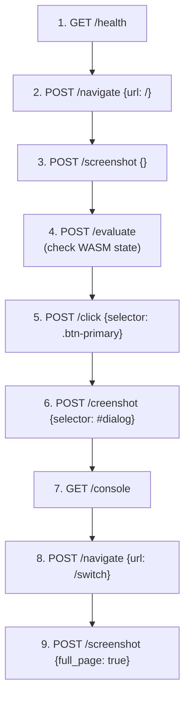

# Tairitsu Debug Agent Skill

> **Protocol version:** 0.1.0 | **Base URL:** `http://localhost:<debug-port>` (default: dev-port + 1)

## Overview

When `tairitsu dev` is launched with `--debug`, the packager exposes a **Debug API server**
on a dedicated port (default: `3001` when dev server is on `3000`). Agents connect via HTTP
to perform browser automation — screenshots, DOM inspection, click/input simulation,
JS evaluation — without needing a separate Playwright or Puppeteer process.

## Startup

```bash
# Start dev server with debug API enabled
just dev --daemon --debug

# Custom debug port
just dev --daemon --debug --debug-port 9223
```

The debug server starts alongside the dev server. Check readiness:

```bash
curl -s http://localhost:3001/health | jq .
```

Expected response:

```json
{
  "ok": true,
  "data": {
    "status": "ok",
    "version": "0.1.0",
    "api_version": "0.1.0",
    "uptime_secs": 42
  }
}
```

## Endpoints

All endpoints return `{"ok": bool, "data"?: ..., "error"?: string}`.
All POST bodies are JSON. All responses are JSON.

### `GET /health`

Liveness check. Always returns 200 if the debug server is running.

### `GET /info`

Server metadata: version, ports, dist dir, package name, PID, uptime, browser status.

### `POST /navigate`

Navigate the managed browser context to a URL.

```json
{
  "url": "/button"
}
```

Relative URLs are resolved against the dev server base (`http://localhost:<dev_port>`).

**Response:** `{ "url": "...", "title": "..." }`

### `POST /screenshot`

Capture a screenshot of the current page (or an element).

```json
{
  "selector": "#hikari-app",
  "full_page": false,
  "format": "png"
}
```

| Field | Type | Default | Description |
|-------|------|---------|-------------|
| `selector` | string? | `null` | CSS selector to screenshot. `null` = full viewport |
| `full_page` | bool? | `false` | Capture full scrollable page |
| `format` | string? | `"png"` | Image format (`png`, `jpeg`) |

**Response:** `{ "data": "<base64-encoded image>", "mime_type": "image/png", "width": 1920, "height": 1080 }`

### `POST /click`

Click an element matching a CSS selector.

```json
{
  "selector": "#my-button",
  "button": "left",
  "modifiers": []
}
```

| Field | Type | Default | Description |
|-------|------|---------|-------------|
| `selector` | string | *(required)* | CSS selector |
| `button` | string? | `"left"` | Mouse button |
| `modifiers` | string[]? | `[]` | Key modifiers (`Shift`, `Control`, `Alt`) |

**Response:** `{ "ok": true }` or error if element not found.

### `POST /type`

Type text into an input element.

```json
{
  "selector": "input[name='search']",
  "text": "hello world",
  "clear_first": true,
  "submit": false
}
```

| Field | Type | Default | Description |
|-------|------|---------|-------------|
| `selector` | string | *(required)* | CSS selector for input/textarea |
| `text` | string | *(required)* | Text to type |
| `clear_first` | bool? | `true` | Clear existing value before typing |
| `submit` | bool? | `false` | Press Enter after typing |

**Response:** `{ "ok": true }`

### `POST /evaluate`

Execute JavaScript in the page context and return the result.

```json
{
  "expression": "document.title",
  "await_promise": false
}
```

| Field | Type | Default | Description |
|-------|------|---------|-------------|
| `expression` | string | *(required)* | JS expression to evaluate |
| `await_promise` | bool? | `false` | If true, awaits the result as a Promise |

**Response:** `{ "result": <serialized JS value>, "type": "string|number|boolean|null|object" }`

> **Security note:** Evaluation runs in the page context. The debug server binds
> to `127.0.0.1` only and should never be exposed to networks.

### `GET /console`

Retrieve recent console log entries from the managed browser.

**Response:** `{ "entries": [{ "level": "log|warn|error", "text": "...", "timestamp": "ISO-8601" }] }`

### `GET /dom?selector=...&attribute=...`

Query DOM elements by CSS selector.

| Query Param | Type | Description |
|-------------|------|-------------|
| `selector` | string | *(required)* CSS selector |
| `attribute` | string? | If set, return only this attribute's value |

**Response:**
```json
{
  "ok": true,
  "data": {
    "tag": "div",
    "text": "Hello World",
    "html": "<div id=\"app\">...</div>",
    "attributes": { "id": "app", "class": "container" },
    "visible": true,
    "count": 1
  }
}
```

## Agent Workflow Example

A typical agent session for visual debugging:



## Error Handling

| Status Code | Meaning |
|-------------|---------|
| 200 | Success |
| 400 | Invalid request body or missing parameters |
| 404 | Unknown endpoint |
| 503 | Browser not connected (headless chromium unavailable) |

When `ok: false`, the `error` field contains a human-readable description.

## Integration Notes

- The debug API uses CORS headers, so cross-origin requests from agent runtimes are allowed.
- Base URLs in `/navigate` are relative to the **dev server**, not the debug server.
- Screenshots return base64-encoded PNG/JPEG data — decode before saving or comparing.
- Console entries are buffered in-memory and cleared when the server restarts.
- Multiple agents can share one debug server; operations are sequential (no locking needed for single-browser use).
