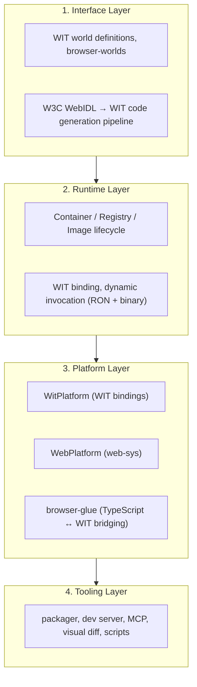
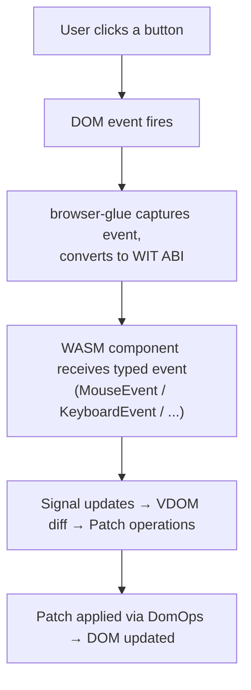
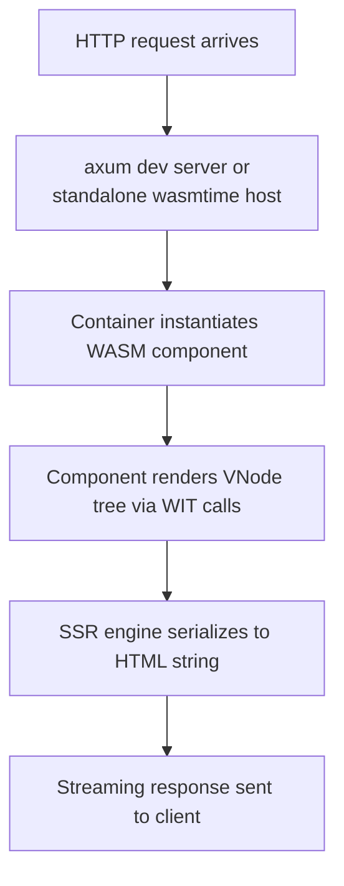

# System Overview

Tairitsu is a full-stack framework powered by the WASM Component Model. A single WASM component can run on the server (via the Container runtime), in the browser (via the VDOM runtime), or at the edge — all through the same WIT interface definitions.

## The Four Layers

## How a Request Flows

### Browser (Client Path)

### Server (SSR Path)

## Core Design Decisions

### Why Component Model instead of wasm-bindgen?

| wasm-bindgen path | WIT path (Tairitsu) |
|:--|:--|
| Rust → wasm-bindgen → JS shim → browser | Rust → WIT → canonical ABI → browser (eventually native) |
| Tight coupling to JS runtime | Language-agnostic WIT interface |
| No server-side reuse | Same component works in any wasmtime host |
| Mature, stable ecosystem (Leptos, Dioxus, Yew) | Emerging, future-facing |

Tairitsu bets on the Component Model becoming the standard for browser-wasm interop, eliminating the need for wasm-bindgen's JS glue layer.

### Why Docker-like Image/Container/Registry?

WASM components need lifecycle management just like containers:

- **Image** = compiled `.wasm` binary + metadata (like a Docker image)
- **Container** = running instance with host-provided WIT imports (like a Docker container)
- **Registry** = collection of images and active containers (like Docker daemon)

This model enables:
- Hot-reload during development (swap Image, keep Container)
- Versioned deployment (tag images, roll back)
- Multi-tenant isolation (separate containers, shared host)
- Dynamic invocation (call into running components at runtime)

## Next Steps

- [Runtime & Container Model](runtime.md) — deep dive into Container/Image/Registry
- [VDOM & Rendering](vdom.md) — how the browser-side VDOM works
- [WIT Pipeline](wit-pipeline.md) — W3C WebIDL → WIT generation
- [Web Backends](web-backends.md) — dual WitPlatform / WebPlatform strategy
- [Browser Glue](browser-glue.md) — TypeScript bridging layer
