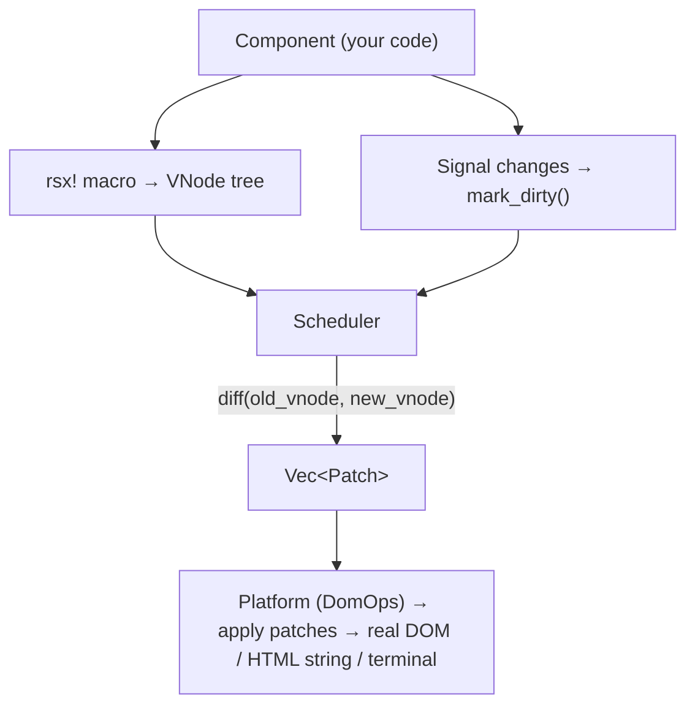
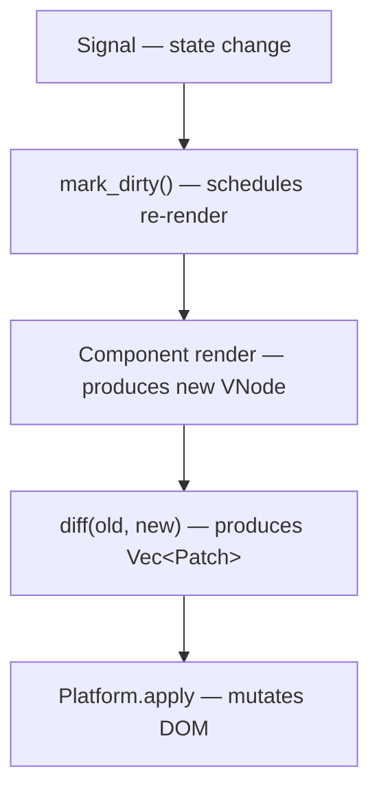
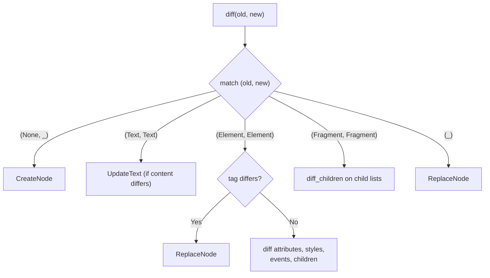
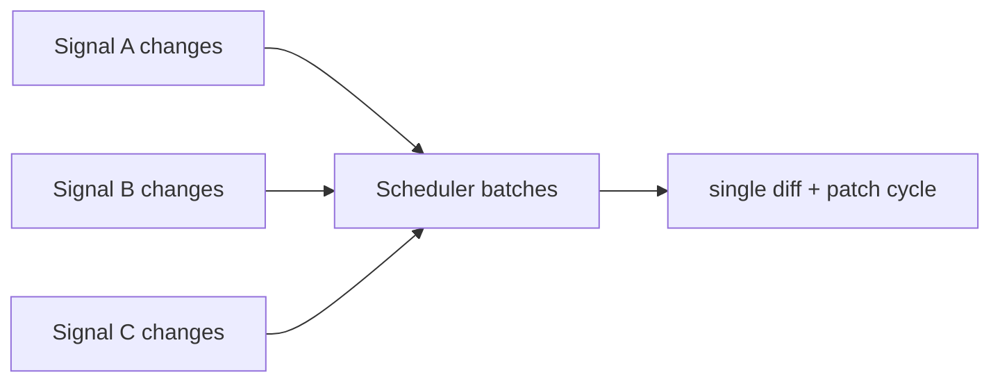

# VDOM & Rendering Engine

Tairitsu's Virtual DOM is a platform-agnostic rendering engine. It can drive browser DOM, server-side HTML strings, or any custom render target — all through a trait-based Platform abstraction.

## Architecture



## VNode Types

```rust
pub enum VNode {
    Text(VText),           // Plain text node
    Element(VElement),     // DOM element (<div>, <button>, etc.)
    Fragment(Vec<VNode>),  // Collection of nodes (no wrapper element)
}
```

### VElement

```rust
pub struct VElement {
    pub tag: String,                        // "div", "span", "button", etc.
    pub namespace: Option<String>,          // SVG namespace
    pub attributes: HashMap<String, String>,
    pub children: Vec<VNode>,
    pub events: Vec<(String, EventHandler)>,
    pub styles: Style,
    pub key: Option<u64>,                   // For keyed diffing
}
```

## The Render Cycle

1. **Component renders** → produces a VNode tree via `rsx!`
2. **Signal changes** → component re-renders → produces new VNode tree
3. **Diff** — compares old tree against new tree, produces a list of Patch operations
4. **Apply patches** — calls into the Platform trait to execute DOM mutations
5. **Repeat** — on next signal change



## Patch Operations

```rust
pub enum Patch {
    CreateNode { node: VNode },           // Insert new node
    RemoveNode,                           // Remove current node
    ReplaceNode { node: VNode },          // Swap entire node
    UpdateText { text: String },          // Text content changed
    UpdateAttribute { name: String, value: String },
    RemoveAttribute { name: String },
    InsertChild { index: usize, node: VNode },
    RemoveChild { index: usize },
    MoveChild { from: usize, to: usize }, // Reorder children (keyed diff)
}
```

## Diff Algorithm

The diffing engine (`packages/vdom/src/diff.rs`) compares two VNode trees node-by-node:



### Keyed Child Diffing (planned)

For lists of elements with unique keys:

```rust
rsx! {
    ul {
        {items.iter().map(|item| rsx! {
            li { key: item.id, ..txt(&item.name) }
        })}
    }
}
```

The keyed diff algorithm identifies insertions, deletions, and moves — minimizing DOM mutations.

## Platform Trait

The Platform trait abstracts all DOM operations behind 14 sub-traits:

```rust
pub trait Platform: DomOps + TimerOps + LayoutOps + ObserverOps
    + MediaQueryOps + ClipboardOps + ContentEditableOps
    + ScrollOps + QueryOps + CanvasOps + MediaOps + GeoOps + FileOps + IdbOps
{}

impl<T> Platform for T where T: DomOps + /* all sub-traits */ {}
```

### DomOps (the core sub-trait)

```rust
pub trait DomOps {
    type Element;
    type Event;

    fn create_element(&self, tag: &str) -> Result<Self::Element>;
    fn create_text_node(&self, text: &str) -> Result<Self::Element>;
    fn append_child(&self, parent: &Self::Element, child: &Self::Element);
    fn remove_child(&self, parent: &Self::Element, child: &Self::Element);
    fn set_attribute(&self, el: &Self::Element, name: &str, value: &str);
    fn set_style(&self, el: &Self::Element, name: &str, value: &str);
    fn add_event_listener(
        &self, el: &Self::Element, event: &str,
        handler: Box<dyn Fn(Self::Event)>,
    );
    fn add_event_listener_with_options(
        &self, el: &Self::Element, event: &str,
        handler: Box<dyn Fn(Self::Event)>,
        options: ListenerOptions,
    );
}
```

### Platform Implementations

| Implementation | Target | Purpose |
|:--|:--|:--|
| `WitPlatform` | wasm32-wasip2 in browser | Uses WIT bindings → browser-glue → DOM |
| `SsrPlatform` | Native (server) | Renders to HTML string buffer |
| `WebPlatform` | wasm32-unknown-unknown | Uses web-sys (legacy compat) |
| `TestPlatform` | Native (tests) | Records DOM mutations for assertions |

## Event System

34+ typed event types with automatic downcast:

```rust
// Type-safe convenience methods
element
    .on_click(|e: &MouseEvent| { ... })
    .on_keydown(|e: &KeyboardEvent| { ... })
    .on_submit(|e: &SubmitEvent| { ... })
    .on_touchstart(|e: &TouchEvent| { ... });

// Generic handler with manual downcast
element.on_event("custom-event", |e: Box<dyn EventData>| {
    if let Some(data) = e.downcast_ref::<MyCustomEvent>() { ... }
});
```

## Reactive Signals

```rust
// Create a signal
let count = Signal::new(0);

// Read (subscribes current component)
let value = count.get();

// Write (triggers re-render for all subscribers)
count.set(value + 1);

// Effect (automatically re-runs when dependencies change)
create_effect(move || {
    let c = count.get();
    // This runs every time count changes
});

// Standalone signal (outside component lifecycle)
let shared = StandaloneSignal::new(42);
```

## Scheduler

The scheduler (`packages/vdom/src/runtime.rs`) coalesces multiple signal updates into a single render pass:



This is similar to React's automatic batching or microtask-based scheduling in Vue 3.
