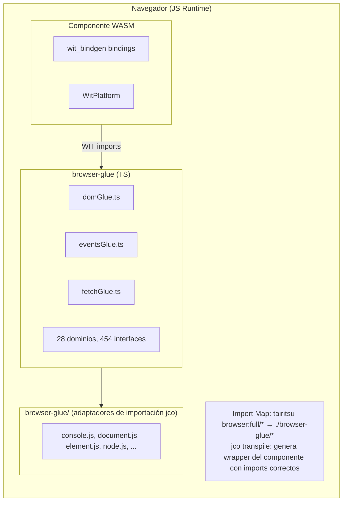

# Arquitectura de Browser Glue

El paquete browser-glue proporciona implementaciones TypeScript de las interfaces WIT `tairitsu-browser:full`, permitiendo que los componentes WebAssembly interactúen con las APIs del navegador a través del Component Model.

## Visión General de la Arquitectura



## Componentes Clave

### TypeScript Glue (`src/*.ts`)

Implementaciones TypeScript autogeneradas de interfaces WIT:

| Dominio | Archivo | Interfaces | Funciones |
|---------|---------|------------|-----------|
| DOM | `domGlue.ts` | 34 | ~300 |
| HTML | `htmlGlue.ts` | 182 | ~1500 |
| CSS | `cssGlue.ts` | 44 | ~400 |
| Canvas | `canvasGlue.ts` | 20 | ~200 |
| Fetch | `fetchGlue.ts` | 25 | ~150 |
| Events | `eventsGlue.ts` | 15 | ~100 |
| ... | ... | ... | ... |

### Declaraciones de Tipos (`dist/*.d.ts`)

Archivos de declaración TypeScript para soporte de IDE y verificación de tipos.

### Wrappers de Interfaces (`dist/browser-glue/*.js`)

Archivos adaptadores mínimos para imports transpilados con jco:

- `console.js` - Interfaz de logging
- `document.js` - Creación de documentos
- `element.js` - Atributos de elementos
- `node.js` - Operaciones del árbol DOM
- `style.js` - Propiedades de estilo CSS
- `event-target.js` - Escuchadores de eventos
- `non-element-parent-node.js` - getElementById
- `window.js` - Dimensiones de ventana

## Integración con jco

### Configuración del Import Map

```html
<script type="importmap">
{
  "imports": {
    "@bytecodealliance/preview2-shim/": "https://esm.sh/@bytecodealliance/preview2-shim/",
    "tairitsu-browser:full/": "./browser-glue/"
  }
}
</script>
```

### Proceso de Transpilación

1. Compilar componente WASM: `cargo build --target wasm32-wasip2 --lib --release`
2. Transpilar con jco: `jco transpile component.wasm -o output/`
3. jco genera wrapper con imports desde `tairitsu-browser:full/*`
4. El import map resuelve a los adaptadores `./browser-glue/*`

## Sistema de Handles

Los objetos del navegador se representan como handles opacos `u64`:

```typescript
// Lado TypeScript
const element = document.createElement('div');
const handle = registerHandle(element); // Retorna bigint

// Lado Rust recibe u64
let handle: u64 = bindings::document::create_element("div", None);
```

### Tabla de Handles (`handles.ts`)

```typescript
const _handles = new Map<bigint, object>();
let _nextHandle = 1n;

export function registerHandle(obj: object): bigint {
  const handle = BigInt(_nextHandle++);
  _handles.set(handle, obj);
  return handle;
}

export function lookupHandle<T>(handle: bigint): T | null {
  return _handles.get(handle) as T ?? null;
}
```

## Proceso de Build

```bash
# Regenerar glue desde WIT
python3 scripts/generate_browser_glue.py

# Build con declaraciones
cd packages/browser-glue && npm run build

# Build de producción con minificación
npm run build:production
```

## Estructura del Paquete

```mermaid
graph TD
    ROOT["packages/browser-glue/"] --> SRC["src/"]
    ROOT --> DIST["dist/"]
    ROOT --> PKG["package.json"]
    SRC --> S1["index.ts — Entrada principal"]
    SRC --> S2["handles.ts — Gestión de handles"]
    SRC --> S3["async.ts — Utilidades async"]
    SRC --> S4["consoleGlue.ts — Interfaz de consola"]
    SRC --> S5["styleGlue.ts — Interfaz de estilos"]
    SRC --> S6["eventTargetGlue.ts — Event target"]
    SRC --> S7["domGlue.ts — Operaciones DOM"]
    SRC --> S8["eventsGlue.ts — Tipos de eventos"]
    SRC --> S9["fetchGlue.ts — Fetch API"]
    SRC --> S10["canvasGlue.ts — Canvas 2D"]
    SRC --> S11["... (28 dominios)"]
    DIST --> D1["index.js — Entrada compilada"]
    DIST --> D2["*.d.ts — Declaraciones de tipos"]
    DIST --> D3["browser-glue/ — Adaptadores jco"]
```


