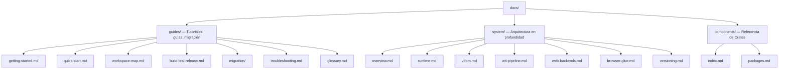

# Documentación de Tairitsu

Tairitsu es un framework full-stack basado en el modelo de componentes WASM. Escribe componentes una vez y ejecútalos en cualquier lugar: servidor, navegador, edge. Toda la comunicación se realiza a través de interfaces WIT con tipado seguro.

## Elige tu camino

| Quiero... | Empieza aquí |
|:--|:--|
| Probarlo en 5 minutos | [Inicio rápido](guides/quick-start.md) |
| Aprender desde cero | [Tutorial de inicio](guides/getting-started.md) |
| Entender la arquitectura | [Resumen del sistema](system/overview.md) |
| Ver todos los paquetes | [Mapa de paquetes](components/index.md) |
| Migrar desde Dioxus | [Guía de migración](guides/migration/dioxus-to-tairitsu.md) |
| Resolver un problema | [Solución de problemas](guides/troubleshooting.md) |
| Explorar el workspace | [Mapa del workspace](guides/workspace-map.md) |
| Consultar términos | [Glosario](guides/glossary.md) |

## Estructura de la documentación

## Otros idiomas

- [English](../en/index.md)
- [简体中文](../zhs/index.md)
- [繁體中文](../zht/index.md)
- [日本語](../ja/index.md)
- [한국어](../ko/index.md)
- [Français](../fr/index.md)
- [Русский](../ru/index.md)
- [العربية](../ar/index.md)
