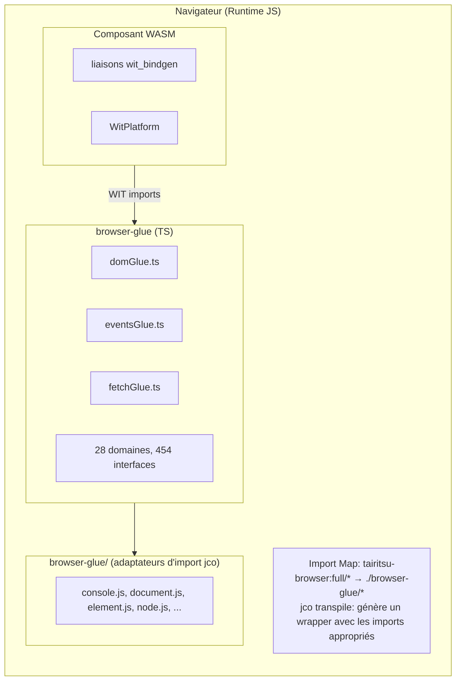

# Architecture Browser Glue

Le package browser-glue fournit des implémentations TypeScript des interfaces WIT `tairitsu-browser:full`, permettant aux composants WebAssembly d'interagir avec les API du navigateur via le Component Model.

## Vue d'ensemble de l'architecture



## Composants clés

### Glue TypeScript (`src/*.ts`)

Implémentations TypeScript générées automatiquement des interfaces WIT :

| Domaine | Fichier | Interfaces | Fonctions |
|---------|---------|------------|-----------|
| DOM | `domGlue.ts` | 34 | ~300 |
| HTML | `htmlGlue.ts` | 182 | ~1500 |
| CSS | `cssGlue.ts` | 44 | ~400 |
| Canvas | `canvasGlue.ts` | 20 | ~200 |
| Fetch | `fetchGlue.ts` | 25 | ~150 |
| Events | `eventsGlue.ts` | 15 | ~100 |
| ... | ... | ... | ... |

### Déclarations de types (`dist/*.d.ts`)

Fichiers de déclaration TypeScript pour le support IDE et la vérification de types.

### Wrappers d'interface (`dist/browser-glue/*.js`)

Fichiers adaptateurs minimaux pour les imports transpilés par jco :

- `console.js` - Interface de journalisation
- `document.js` - Création de document
- `element.js` - Attributs d'élément
- `node.js` - Opérations sur l'arbre DOM
- `style.js` - Propriétés de style CSS
- `event-target.js` - Écouteurs d'événements
- `non-element-parent-node.js` - getElementById
- `window.js` - Dimensions de fenêtre

## Intégration jco

### Configuration de l'Import Map

```html
<script type="importmap">
{
  "imports": {
    "@bytecodealliance/preview2-shim/": "https://esm.sh/@bytecodealliance/preview2-shim/",
    "tairitsu-browser:full/": "./browser-glue/"
  }
}
</script>
```

### Processus de transpilation

1. Compiler le composant WASM : `cargo build --target wasm32-wasip2 --lib --release`
2. Transpiler avec jco : `jco transpile component.wasm -o output/`
3. jco génère un wrapper avec les imports depuis `tairitsu-browser:full/*`
4. L'import map résout vers les adaptateurs `./browser-glue/*`

## Système de handles

Les objets du navigateur sont représentés comme des handles opaques `u64` :

```typescript
// Côté TypeScript
const element = document.createElement('div');
const handle = registerHandle(element); // Retourne bigint

// Le côté Rust reçoit u64
let handle: u64 = bindings::document::create_element("div", None);
```

### Table de handles (`handles.ts`)

```typescript
const _handles = new Map<bigint, object>();
let _nextHandle = 1n;

export function registerHandle(obj: object): bigint {
  const handle = BigInt(_nextHandle++);
  _handles.set(handle, obj);
  return handle;
}

export function lookupHandle<T>(handle: bigint): T | null {
  return _handles.get(handle) as T ?? null;
}
```

## Processus de compilation

```bash
# Régénérer la glue depuis WIT
python3 scripts/generate_browser_glue.py

# Compiler avec les déclarations
cd packages/browser-glue && npm run build

# Build de production avec minification
npm run build:production
```

## Structure du package

```mermaid
graph TD
    ROOT["packages/browser-glue/"] --> SRC["src/"]
    ROOT --> DIST["dist/"]
    ROOT --> PKG["package.json"]
    SRC --> S1["index.ts — Point d'entrée principal"]
    SRC --> S2["handles.ts — Gestion des handles"]
    SRC --> S3["async.ts — Utilitaires async"]
    SRC --> S4["consoleGlue.ts — Interface console"]
    SRC --> S5["styleGlue.ts — Interface style"]
    SRC --> S6["eventTargetGlue.ts — Cible d'événement"]
    SRC --> S7["domGlue.ts — Opérations DOM"]
    SRC --> S8["eventsGlue.ts — Types d'événements"]
    SRC --> S9["fetchGlue.ts — API Fetch"]
    SRC --> S10["canvasGlue.ts — Canvas 2D"]
    SRC --> S11["... (28 domaines)"]
    DIST --> D1["index.js — Entrée compilée"]
    DIST --> D2["*.d.ts — Déclarations de types"]
    DIST --> D3["browser-glue/ — Adaptateurs jco"]
```


