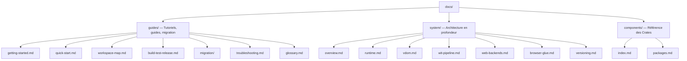

# Documentation Tairitsu

Tairitsu est un framework full-stack propulsé par le modèle de composants WASM. Écrivez des composants une seule fois et exécutez-les partout — serveur, navigateur, edge. Toute la communication est typée via WIT.

## Choisissez votre parcours

| Je veux... | Commencer ici |
|:--|:--|
| Essayer en 5 minutes | [Démarrage rapide](guides/quick-start.md) |
| Apprendre depuis le début | [Tutoriel de démarrage](guides/getting-started.md) |
| Comprendre l'architecture | [Vue d'ensemble du système](system/overview.md) |
| Voir tous les paquets | [Carte des paquets](components/index.md) |
| Migrer depuis Dioxus | [Guide de migration](guides/migration/dioxus-to-tairitsu.md) |
| Résoudre un problème | [Dépannage](guides/troubleshooting.md) |
| Explorer le workspace | [Carte du workspace](guides/workspace-map.md) |
| Consulter les termes | [Glossaire](guides/glossary.md) |

## Structure de la documentation

## Autres langues

- [English](../en/index.md)
- [简体中文](../zhs/index.md)
- [繁體中文](../zht/index.md)
- [日本語](../ja/index.md)
- [한국어](../ko/index.md)
- [Español](../es/index.md)
- [Русский](../ru/index.md)
- [العربية](../ar/index.md)
