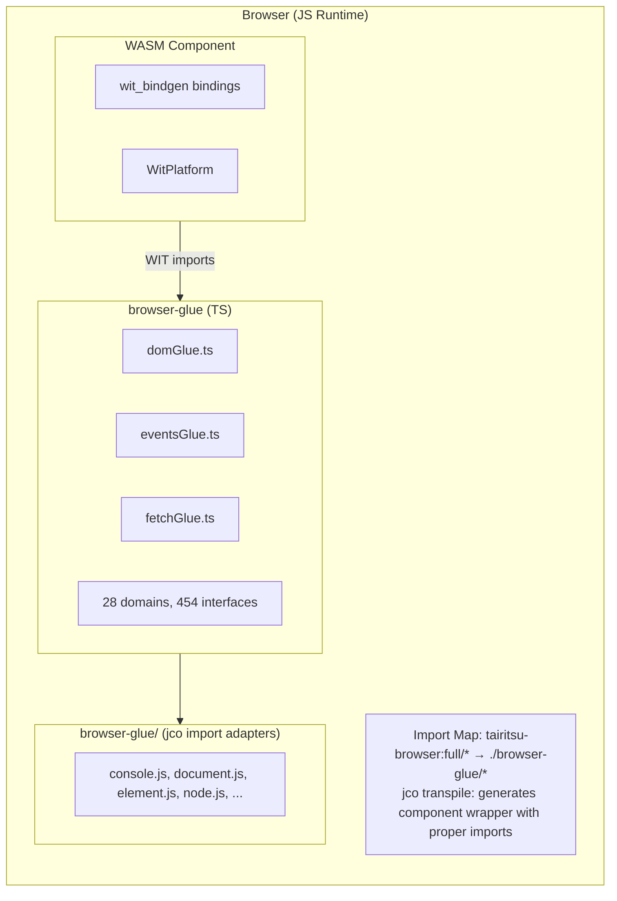
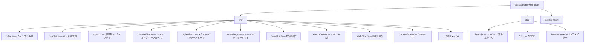

# Browser Glue アーキテクチャ

browser-glueパッケージは、`tairitsu-browser:full` WITインターフェースのTypeScript実装を提供し、WebAssemblyコンポーネントがコンポーネントモデルを通じてブラウザAPIと対話できるようにします。

## アーキテクチャ概要



## 主要コンポーネント

### TypeScript Glue (`src/*.ts`)

WITインターフェースの自動生成TypeScript実装：

| ドメイン | ファイル | インターフェース | 関数 |
|----------|----------|------------------|------|
| DOM | `domGlue.ts` | 34 | ~300 |
| HTML | `htmlGlue.ts` | 182 | ~1500 |
| CSS | `cssGlue.ts` | 44 | ~400 |
| Canvas | `canvasGlue.ts` | 20 | ~200 |
| Fetch | `fetchGlue.ts` | 25 | ~150 |
| Events | `eventsGlue.ts` | 15 | ~100 |
| ... | ... | ... | ... |

### 型宣言ファイル (`dist/*.d.ts`)

IDEサポートと型チェックのためのTypeScript宣言ファイル。

### インターフェースラッパー (`dist/browser-glue/*.js`)

jcoトランスパイル済みインポート用の最小アダプターファイル：

- `console.js` - ログインターフェース
- `document.js` - ドキュメント作成
- `element.js` - 要素属性
- `node.js` - DOMツリー操作
- `style.js` - CSSスタイルプロパティ
- `event-target.js` - イベントリスナー
- `non-element-parent-node.js` - getElementById
- `window.js` - ウィンドウサイズ

## jco統合

### Import Map設定

```html
<script type="importmap">
{
  "imports": {
    "@bytecodealliance/preview2-shim/": "https://esm.sh/@bytecodealliance/preview2-shim/",
    "tairitsu-browser:full/": "./browser-glue/"
  }
}
</script>
```

### トランスパイルプロセス

1. WASMコンポーネントをビルド: `cargo build --target wasm32-wasip2 --lib --release`
2. jcoでトランスパイル: `jco transpile component.wasm -o output/`
3. jcoが `tairitsu-browser:full/*` からのインポートを含むラッパーを生成
4. Import Mapが `./browser-glue/*` アダプターに解決

## ハンドルシステム

ブラウザオブジェクトは不透明な `u64` ハンドルとして表現されます：

```typescript
// TypeScript側
const element = document.createElement('div');
const handle = registerHandle(element); // bigintを返す

// Rust側はu64を受け取る
let handle: u64 = bindings::document::create_element("div", None);
```

### ハンドルテーブル (`handles.ts`)

```typescript
const _handles = new Map<bigint, object>();
let _nextHandle = 1n;

export function registerHandle(obj: object): bigint {
  const handle = BigInt(_nextHandle++);
  _handles.set(handle, obj);
  return handle;
}

export function lookupHandle<T>(handle: bigint): T | null {
  return _handles.get(handle) as T ?? null;
}
```

## ビルドプロセス

```bash
# WITからグルーを再生成
python3 scripts/generate_browser_glue.py

# 宣言付きでビルド
cd packages/browser-glue && npm run build

# 圧縮付き本番ビルド
npm run build:production
```

## パッケージ構成


