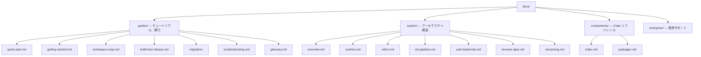

# Tairitsu ドキュメント

Tairitsu は WASM Component Model を基盤とするフルスタックフレームワークです。コンポーネントを一度書けば、サーバー・ブラウザ・エッジのどこでも実行できます。すべての通信は WIT インターフェースで型付けされます。

## はじめに

| 目的 | ページ |
|:--|:--|
| 5分で試す | [クイックスタート](guides/quick-start.md) |
| 基礎から学ぶ | [入門チュートリアル](guides/getting-started.md) |
| アーキテクチャを理解する | [システム概要](system/overview.md) |
| 全パッケージを見る | [パッケージ一覧](components/index.md) |
| Dioxus から移行する | [移行ガイド](guides/migration/dioxus-to-tairitsu.md) |
| 問題を解決する | [トラブルシューティング](guides/troubleshooting.md) |
| ワークスペースを眺める | [ワークスペース構成](guides/workspace-map.md) |
| 用語を調べる | [用語集](guides/glossary.md) |

## ドキュメント構成

## 他の言語

- [English](../en/index.md)
- [简体中文](../zhs/index.md)
- [繁體中文](../zht/index.md)
- [한국어](../ko/index.md)
- [Español](../es/index.md)
- [Français](../fr/index.md)
- [Русский](../ru/index.md)
- [العربية](../ar/index.md)
