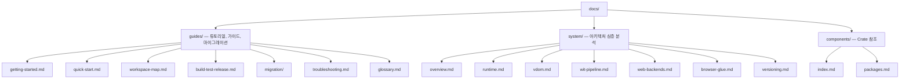

# Tairitsu 문서

Tairitsu는 WASM Component Model 기반의 풀스택 프레임워크입니다. 컴포넌트를 한 번 작성하면 서버, 브라우저, 엣지 어디서든 실행할 수 있습니다. 모든 통신은 WIT 인터페이스로 타입 안전하게 이루어집니다.

## 시작하기

| 목적 | 페이지 |
|:--|:--|
| 5분 안에 체험하기 | [빠른 시작](guides/quick-start.md) |
| 기초부터 배우기 | [시작하기 튜토리얼](guides/getting-started.md) |
| 아키텍처 이해하기 | [시스템 개요](system/overview.md) |
| 전체 패키지 보기 | [패키지 맵](components/index.md) |
| Dioxus에서 마이그레이션 | [마이그레이션 가이드](guides/migration/dioxus-to-tairitsu.md) |
| 문제 해결하기 | [문제 해결](guides/troubleshooting.md) |
| 워크스페이스 둘러보기 | [워크스페이스 맵](guides/workspace-map.md) |
| 용어 찾아보기 | [용어집](guides/glossary.md) |

## 문서 구조

## 다른 언어

- [English](../en/index.md)
- [简体中文](../zhs/index.md)
- [繁體中文](../zht/index.md)
- [日本語](../ja/index.md)
- [Español](../es/index.md)
- [Français](../fr/index.md)
- [Русский](../ru/index.md)
- [العربية](../ar/index.md)
