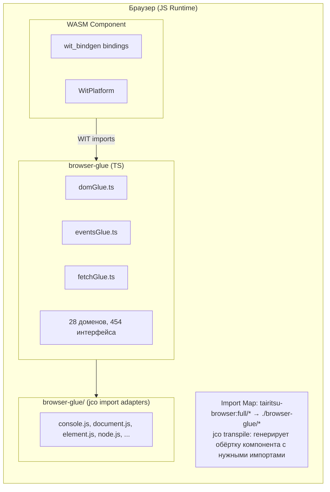

# Архитектура Browser Glue

Пакет browser-glue предоставляет TypeScript-реализации WIT-интерфейсов `tairitsu-browser:full`, позволяя компонентам WebAssembly взаимодействовать с браузерными API через Component Model.

## Обзор архитектуры



## Ключевые компоненты

### TypeScript Glue (`src/*.ts`)

Автоматически сгенерированные TypeScript-реализации WIT-интерфейсов:

| Домен | Файл | Интерфейсы | Функции |
|-------|------|------------|---------|
| DOM | `domGlue.ts` | 34 | ~300 |
| HTML | `htmlGlue.ts` | 182 | ~1500 |
| CSS | `cssGlue.ts` | 44 | ~400 |
| Canvas | `canvasGlue.ts` | 20 | ~200 |
| Fetch | `fetchGlue.ts` | 25 | ~150 |
| Events | `eventsGlue.ts` | 15 | ~100 |
| ... | ... | ... | ... |

### Декларации типов (`dist/*.d.ts`)

Файлы деклараций TypeScript для поддержки IDE и проверки типов.

### Обёртки интерфейсов (`dist/browser-glue/*.js`)

Минимальные файлы-адаптеры для импортов jco transpiled:

- `console.js` - Интерфейс логирования
- `document.js` - Создание документа
- `element.js` - Атрибуты элементов
- `node.js` - Операции с DOM-деревом
- `style.js` - CSS-свойства стилей
- `event-target.js` - Слушатели событий
- `non-element-parent-node.js` - getElementById
- `window.js` - Размеры окна

## Интеграция с jco

### Конфигурация Import Map

```html
<script type="importmap">
{
  "imports": {
    "@bytecodealliance/preview2-shim/": "https://esm.sh/@bytecodealliance/preview2-shim/",
    "tairitsu-browser:full/": "./browser-glue/"
  }
}
</script>
```

### Процесс транспиляции

1. Сборка WASM-компонента: `cargo build --target wasm32-wasip2 --lib --release`
2. Транспиляция через jco: `jco transpile component.wasm -o output/`
3. jco генерирует обёртку с импортами из `tairitsu-browser:full/*`
4. Import Map резолвит в `./browser-glue/*` адаптеры

## Система дескрипторов

Браузерные объекты представлены как непрозрачные дескрипторы `u64`:

```typescript
// На стороне TypeScript
const element = document.createElement('div');
const handle = registerHandle(element); // Возвращает bigint

// На стороне Rust получает u64
let handle: u64 = bindings::document::create_element("div", None);
```

### Таблица дескрипторов (`handles.ts`)

```typescript
const _handles = new Map<bigint, object>();
let _nextHandle = 1n;

export function registerHandle(obj: object): bigint {
  const handle = BigInt(_nextHandle++);
  _handles.set(handle, obj);
  return handle;
}

export function lookupHandle<T>(handle: bigint): T | null {
  return _handles.get(handle) as T ?? null;
}
```

## Процесс сборки

```bash
# Регенерация glue из WIT
python3 scripts/generate_browser_glue.py

# Сборка с декларациями
cd packages/browser-glue && npm run build

# Продакшн-сборка с минификацией
npm run build:production
```

## Структура пакета

```mermaid
graph TD
    ROOT["packages/browser-glue/"] --> SRC["src/"]
    ROOT --> DIST["dist/"]
    ROOT --> PKG["package.json"]
    SRC --> S1["index.ts — Главный вход"]
    SRC --> S2["handles.ts — Управление дескрипторами"]
    SRC --> S3["async.ts — Утилиты async"]
    SRC --> S4["consoleGlue.ts — Интерфейс консоли"]
    SRC --> S5["styleGlue.ts — Интерфейс стилей"]
    SRC --> S6["eventTargetGlue.ts — Цель событий"]
    SRC --> S7["domGlue.ts — DOM-операции"]
    SRC --> S8["eventsGlue.ts — Типы событий"]
    SRC --> S9["fetchGlue.ts — Fetch API"]
    SRC --> S10["canvasGlue.ts — Canvas 2D"]
    SRC --> S11["... (28 доменов)"]
    DIST --> D1["index.js — Скомпилированный вход"]
    DIST --> D2["*.d.ts — Декларации типов"]
    DIST --> D3["browser-glue/ — jco адаптеры"]
```


