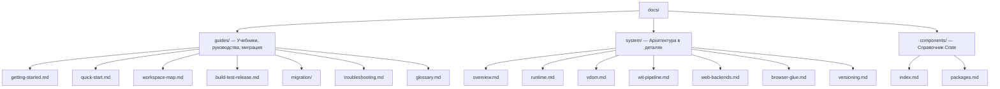

# Документация Tairitsu

Tairitsu — полнофункциональный фреймворк на базе модели компонентов WASM. Напишите компоненты один раз и запускайте их где угодно — сервер, браузер, edge. Вся коммуникация типизирована через WIT.

## Выберите свой путь

| Я хочу... | Начните здесь |
|:--|:--|
| Попробовать за 5 минут | [Быстрый старт](guides/quick-start.md) |
| Учиться с нуля | [Руководство для начинающих](guides/getting-started.md) |
| Понять архитектуру | [Обзор системы](system/overview.md) |
| Посмотреть все пакеты | [Карта пакетов](components/index.md) |
| Мигрировать с Dioxus | [Руководство по миграции](guides/migration/dioxus-to-tairitsu.md) |
| Решить проблему | [Устранение неполадок](guides/troubleshooting.md) |
| Просмотреть workspace | [Карта workspace](guides/workspace-map.md) |
| Посмотреть термины | [Глоссарий](guides/glossary.md) |

## Структура документации

## Другие языки

- [English](../en/index.md)
- [简体中文](../zhs/index.md)
- [繁體中文](../zht/index.md)
- [日本語](../ja/index.md)
- [한국어](../ko/index.md)
- [Español](../es/index.md)
- [Français](../fr/index.md)
- [العربية](../ar/index.md)
