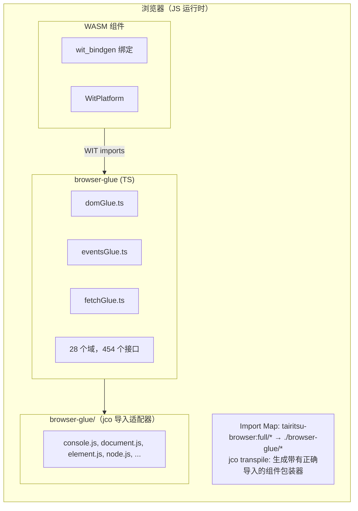
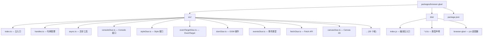

# Browser Glue 架构

browser-glue 包提供了 `tairitsu-browser:full` WIT 接口的 TypeScript 实现，使 WebAssembly 组件能够通过 Component Model 与浏览器 API 交互。

## 架构概览



## 核心组件

### TypeScript Glue（`src/*.ts`）

自动生成的 WIT 接口 TypeScript 实现：

| 域 | 文件 | 接口数 | 函数数 |
|----|------|--------|--------|
| DOM | `domGlue.ts` | 34 | ~300 |
| HTML | `htmlGlue.ts` | 182 | ~1500 |
| CSS | `cssGlue.ts` | 44 | ~400 |
| Canvas | `canvasGlue.ts` | 20 | ~200 |
| Fetch | `fetchGlue.ts` | 25 | ~150 |
| Events | `eventsGlue.ts` | 15 | ~100 |
| ... | ... | ... | ... |

### 类型声明（`dist/*.d.ts`）

用于 IDE 支持和类型检查的 TypeScript 声明文件。

### 接口包装器（`dist/browser-glue/*.js`）

用于 jco 转译导入的最小适配器文件：

- `console.js` - 日志接口
- `document.js` - 文档创建
- `element.js` - 元素属性
- `node.js` - DOM 树操作
- `style.js` - CSS 样式属性
- `event-target.js` - 事件监听器
- `non-element-parent-node.js` - getElementById
- `window.js` - 窗口尺寸

## jco 集成

### Import Map 配置

```html
<script type="importmap">
{
  "imports": {
    "@bytecodealliance/preview2-shim/": "https://esm.sh/@bytecodealliance/preview2-shim/",
    "tairitsu-browser:full/": "./browser-glue/"
  }
}
</script>
```

### 转译流程

1. 构建 WASM 组件：`cargo build --target wasm32-wasip2 --lib --release`
2. 使用 jco 转译：`jco transpile component.wasm -o output/`
3. jco 生成从 `tairitsu-browser:full/*` 导入的包装器
4. Import Map 解析到 `./browser-glue/*` 适配器

## 句柄系统

浏览器对象表示为不透明的 `u64` 句柄：

```typescript
// TypeScript 端
const element = document.createElement('div');
const handle = registerHandle(element); // 返回 bigint

// Rust 端接收 u64
let handle: u64 = bindings::document::create_element("div", None);
```

### 句柄表（`handles.ts`）

```typescript
const _handles = new Map<bigint, object>();
let _nextHandle = 1n;

export function registerHandle(obj: object): bigint {
  const handle = BigInt(_nextHandle++);
  _handles.set(handle, obj);
  return handle;
}

export function lookupHandle<T>(handle: bigint): T | null {
  return _handles.get(handle) as T ?? null;
}
```

## 构建流程

```bash
# 从 WIT 重新生成 glue
python3 scripts/generate_browser_glue.py

# 构建并生成声明文件
cd packages/browser-glue && npm run build

# 生产构建（带压缩）
npm run build:production
```

## 包结构


