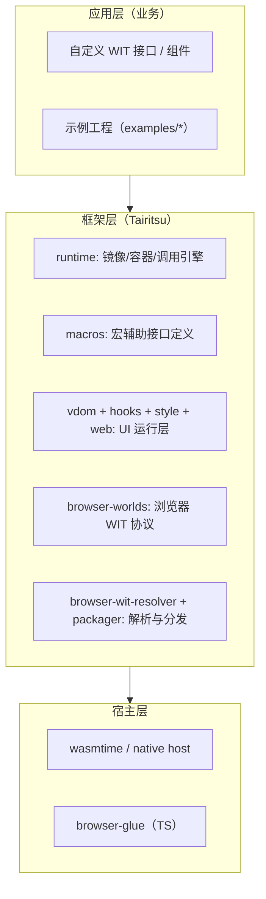

# 系统架构总览

Tairitsu 是面向 WebAssembly Component Model 的通用运行时，核心目标是：

- 不绑定单一业务 WIT
- 提供可插拔宿主导入与客体导出调用
- 同时支持编译期与运行期接口路径

## 架构分层

## 关键设计原则

1. 接口先行：优先通过 WIT 描述协议
2. 运行时解耦：容器模型不绑定业务语义
3. 双路径共存：`web` 与 `wit-bindings` 可并行演进
4. 离线优先：WIT 缓存支持无网构建

## 你应该从哪里开始

- 运行时能力：见 [runtime](./runtime.md)
- 浏览器协议与生成：见 [wit-pipeline](./wit-pipeline.md)
- 双后端平台：见 [web-backends](./web-backends.md)
- 版本治理：见 [versioning](./versioning.md)
