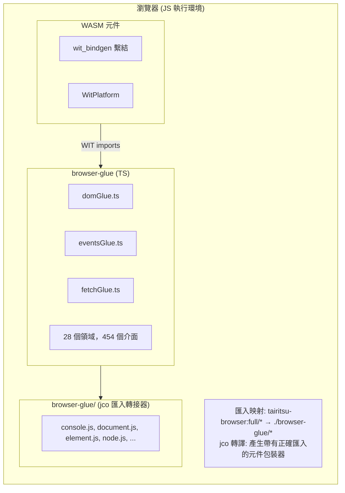
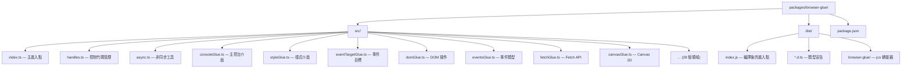

# Browser Glue 架構

browser-glue 套件提供 `tairitsu-browser:full` WIT 介面的 TypeScript 實作，讓 WebAssembly 元件能透過元件模型與瀏覽器 API 互動。

## 架構總覽



## 核心元件

### TypeScript Glue (`src/*.ts`)

自動產生的 WIT 介面 TypeScript 實作：

| 領域 | 檔案 | 介面數 | 函式數 |
|------|------|--------|--------|
| DOM | `domGlue.ts` | 34 | ~300 |
| HTML | `htmlGlue.ts` | 182 | ~1500 |
| CSS | `cssGlue.ts` | 44 | ~400 |
| Canvas | `canvasGlue.ts` | 20 | ~200 |
| Fetch | `fetchGlue.ts` | 25 | ~150 |
| Events | `eventsGlue.ts` | 15 | ~100 |
| ... | ... | ... | ... |

### 類型宣告 (`dist/*.d.ts`)

提供 IDE 支援與類型檢查的 TypeScript 宣告檔案。

### 介面包裝器 (`dist/browser-glue/*.js`)

jco 轉譯匯入的最小轉接器檔案：

- `console.js` - 日誌介面
- `document.js` - 文件建立
- `element.js` - 元素屬性
- `node.js` - DOM 樹操作
- `style.js` - CSS 樣式屬性
- `event-target.js` - 事件監聽器
- `non-element-parent-node.js` - getElementById
- `window.js` - 視窗尺寸

## jco 整合

### 匯入映射設定

```html
<script type="importmap">
{
  "imports": {
    "@bytecodealliance/preview2-shim/": "https://esm.sh/@bytecodealliance/preview2-shim/",
    "tairitsu-browser:full/": "./browser-glue/"
  }
}
</script>
```

### 轉譯流程

1. 建置 WASM 元件：`cargo build --target wasm32-wasip2 --lib --release`
2. 使用 jco 轉譯：`jco transpile component.wasm -o output/`
3. jco 產生帶有 `tairitsu-browser:full/*` 匯入的包裝器
4. 匯入映射解析至 `./browser-glue/*` 轉接器

## 控制代碼系統

瀏覽器物件以不透明的 `u64` 控制代碼表示：

```typescript
// TypeScript 端
const element = document.createElement('div');
const handle = registerHandle(element); // 回傳 bigint

// Rust 端接收 u64
let handle: u64 = bindings::document::create_element("div", None);
```

### 控制代碼表 (`handles.ts`)

```typescript
const _handles = new Map<bigint, object>();
let _nextHandle = 1n;

export function registerHandle(obj: object): bigint {
  const handle = BigInt(_nextHandle++);
  _handles.set(handle, obj);
  return handle;
}

export function lookupHandle<T>(handle: bigint): T | null {
  return _handles.get(handle) as T ?? null;
}
```

## 建置流程

```bash
# 從 WIT 重新產生 glue
python3 scripts/generate_browser_glue.py

# 建置並產生宣告檔
cd packages/browser-glue && npm run build

# 生產環境建置（含最小化）
npm run build:production
```

## 套件結構


