# Tairitsu 文档

Tairitsu 是一个基于 WASM Component Model 的全栈框架。一次编写组件，到处运行——服务端、浏览器、边缘节点。所有通信通过 WIT 类型化接口。

## 选择你的路径

| 我想... | 从这里开始 |
|:--|:--|
| 5分钟快速体验 | [快速开始](guides/quick-start.md) |
| 从零学习 | [入门教程](guides/getting-started.md) |
| 理解架构 | [系统概览](system/overview.md) |
| 查看所有包 | [分层包清单](components/index.md) |
| 从 Dioxus 迁移 | [迁移指南](guides/migration/dioxus-to-tairitsu.md) |
| 解决问题 | [故障排除](guides/troubleshooting.md) |
| 浏览代码仓 | [工作区导览](guides/workspace-map.md) |
| 查阅术语 | [术语表](guides/glossary.md) |

## 文档结构

```mermaid
graph TD
    ROOT["docs/"] --> GUIDES["guides/ — 教程、操作指南、迁移"]
    ROOT --> SYSTEM["system/ — 架构深入"]
    ROOT --> COMPONENTS["components/ — Crate 参考"]
    ROOT --> SKILLS["skills/ — 高级用法"]
    ROOT --> ENTERPRISE["enterprise/ — 商业支持"]
    GUIDES --> GS["getting-started.md"]
    GUIDES --> QS["quick-start.md"]
    GUIDES --> WM["workspace-map.md"]
    GUIDES --> BTR["build-test-release.md"]
    GUIDES --> MIG["migration/"]
    GUIDES --> TS["troubleshooting.md"]
    GUIDES --> GL["glossary.md"]
    SYSTEM --> OV["overview.md"]
    SYSTEM --> RT["runtime.md"]
    SYSTEM --> VD["vdom.md"]
    SYSTEM --> WP["wit-pipeline.md"]
    SYSTEM --> WB["web-backends.md"]
    SYSTEM --> BG["browser-glue.md"]
    SYSTEM --> VER["versioning.md"]
    COMPONENTS --> CI["index.md"]
    COMPONENTS --> PKG["packages.md"]
    SKILLS --> DA["debug-agent.md"]
    ENTERPRISE --> SUP["support.md"]
```

## 其他语言

- [English](../en/index.md)
- [繁體中文](../zht/index.md)
- [日本語](../ja/index.md)
- [한국어](../ko/index.md)
- [Español](../es/index.md)
- [Français](../fr/index.md)
- [Русский](../ru/index.md)
- [العربية](../ar/index.md)
