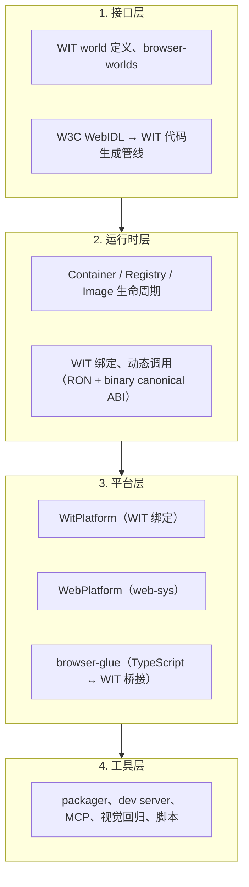
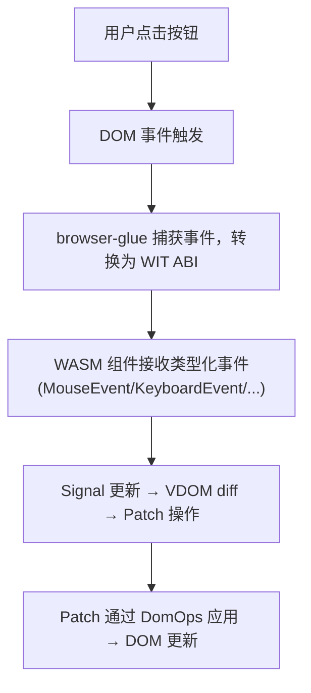
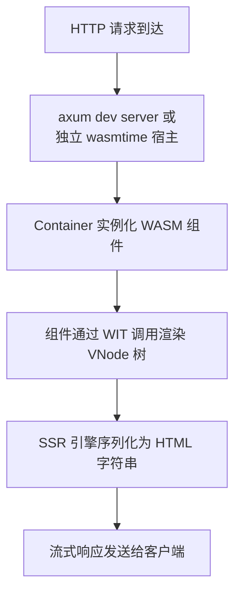

# 系统概览

Tairitsu 是一个基于 WASM Component Model 的全栈框架。同一个 WASM 组件可以在服务端（Container 运行时）、浏览器（VDOM 运行时）和边缘节点运行——全部通过相同的 WIT 接口定义。

## 四层架构

## 请求流程

### 浏览器（客户端路径）

### 服务端（SSR 路径）

## 核心设计决策

### 为什么选择 Component Model 而非 wasm-bindgen？

| wasm-bindgen 路径 | WIT 路径（Tairitsu） |
|:--|:--|
| Rust → wasm-bindgen → JS shim → 浏览器 | Rust → WIT → canonical ABI → 浏览器（未来原生） |
| 与 JS 运行时紧密耦合 | 语言无关的 WIT 接口 |
| 无法在服务端复用 | 同一组件可在任何 wasmtime 宿主运行 |
| 成熟稳定的生态（Leptos, Dioxus, Yew） | 新兴、面向未来 |

Tairitsu 押注 Component Model 将成为浏览器-wasm 互操作的标准，从而消除对 wasm-bindgen JS 胶水层的需求。

### 为什么采用 Docker-like 的 Image/Container/Registry？

WASM 组件需要类似容器的生命周期管理：

- **Image** = 编译后的 `.wasm` 二进制 + 元数据（类似 Docker 镜像）
- **Container** = 运行中实例，带宿主提供的 WIT imports（类似 Docker 容器）
- **Registry** = 镜像和活跃容器的集合（类似 Docker daemon）

这一模型支持：
- 开发时热重载（替换 Image，保留 Container）
- 版本化部署（标记镜像，回滚）
- 多租户隔离（分离容器，共享宿主）
- 动态调用（在运行时调用运行中的组件）

## 下一步

- [运行时与容器模型](runtime.md) — 深入了解 Container/Image/Registry
- [VDOM 与渲染](vdom.md) — 浏览器端 VDOM 工作原理
- [WIT 管线](wit-pipeline.md) — W3C WebIDL → WIT 生成
- [Web 后端](web-backends.md) — 双 WitPlatform / WebPlatform 策略
- [浏览器胶水层](browser-glue.md) — TypeScript 桥接层
