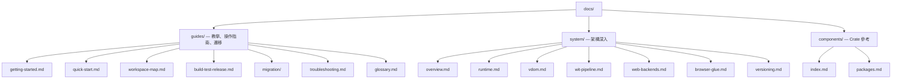

# Tairitsu 文档（繁體中文）

Tairitsu 是基於 WASM Component Model 的全端框架。一次撰寫元件，即可在伺服器、瀏覽器、邊緣節點上執行。所有通訊透過 WIT 型別化介面。

## 選擇你的路徑

| 我想... | 從這裡開始 |
|:--|:--|
| 5分鐘快速體驗 | [快速開始](guides/quick-start.md) |
| 從零學習 | [入門教學](guides/getting-started.md) |
| 理解架構 | [系統總覽](system/overview.md) |
| 檢視所有套件 | [分層套件清單](components/index.md) |
| 從 Dioxus 遷移 | [遷移指南](guides/migration/dioxus-to-tairitsu.md) |
| 解決問題 | [疑難排解](guides/troubleshooting.md) |
| 瀏覽工作區 | [工作區導覽](guides/workspace-map.md) |
| 查閱術語 | [術語表](guides/glossary.md) |

## 文件結構

## 其他語言

- [English](../en/index.md)
- [简体中文](../zhs/index.md)
- [日本語](../ja/index.md)
- [한국어](../ko/index.md)
- [Español](../es/index.md)
- [Français](../fr/index.md)
- [Русский](../ru/index.md)
- [العربية](../ar/index.md)
