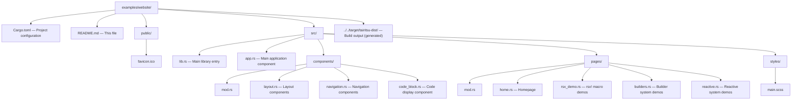

# Tairitsu Framework Website Demo

A comprehensive demonstration of the Tairitsu framework's core features, inspired by Hikari's website demo structure.

## Features

This demo showcases:

- **rsx! Macro**: Declarative UI syntax for building components
- **Builder System**: StyleBuilder, ClassesBuilder, and AnimationBuilder
- **Reactive System**: Signal, Effect, and state management hooks
- **Platform Abstraction**: Cross-platform WebPlatform implementation

## Project Structure



## Running the Demo

### Development Mode

```bash
# Using tairitsu-packager (recommended)
cd examples/website
cargo run --package tairitsu-packager -- dev --open

# Or using just
just dev
```

### Production Build

```bash
cargo run --package tairitsu-packager -- build --release
```

### Serve Production Build

```bash
cd ../../target/tairitsu-dist
python3 -m http.server 3001
```

## Demo Sections

### 1. Home Page

- Framework introduction
- Feature overview
- Quick start guide

### 2. rsx! Macro Demo

- Basic elements and attributes
- Dynamic content and expressions
- Conditional rendering
- Loops and iteration
- Event handling

### 3. Builder System Demo

- **StyleBuilder**: CSS style construction
- **ClassesBuilder**: Dynamic class management
- **AnimationBuilder**: Animation configuration
- Integration with reactive system

### 4. Reactive System Demo

- **use_state**: Local state management
- **use_signal**: Reactive signals
- **use_effect**: Side effects
- **use_style**: Dynamic styling
- Performance optimization with batch updates

## Multi-language Support

All documentation and examples are available in multiple languages:

- 🇨🇳 Chinese (zh-CN)
- 🇺🇸 English (en-US)
- 🇯🇵 Japanese (ja-JP)

## Architecture

Built with:

- **Frontend**: Tairitsu vdom + hooks + rsx! macro
- **Build Tool**: tairitsu-packager (component-first)
- **Configuration**: Cargo.toml metadata (no HTML templates)

## Comparison with Hikari Website

| Aspect | Legacy site stack | Tairitsu Website |
|--------|-------------------|------------------|
| Framework | mixed historical stack | Tairitsu (custom vdom) |
| UI Syntax | rsx-like | rsx! |
| Styling | custom | StyleBuilder (shared) |
| State | mixed reactive patterns | Custom reactive system |
| Build Tool | external wasm tooling | tairitsu-packager |
| Focus | component showcase | framework mechanisms |

## Development Status

- ✅ Project structure
- ✅ Basic configuration
- 🚧 Component implementation
- 🚧 Page content
- 🚧 Multi-language support
- 🚧 E2E testing

## Contributing

This demo serves as both documentation and testing ground for Tairitsu framework features. Contributions are welcome!

## License

MIT
