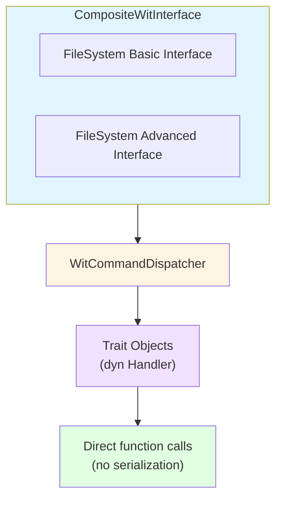

# Simple Trait-Based Composable WIT Interfaces

This example demonstrates a simple trait-based approach to composing multiple WIT interfaces without runtime serialization overhead.

## Key Concepts

### 1. WitCommand Trait

Defines the interface for type-safe commands that can be dispatched:

```rust
pub trait WitCommand: Send + Sync + 'static {
    type Response: Send + Sync + 'static;
    fn command_name(&self) -> &'static str;
    fn as_any(&self) -> &dyn Any;
}
```

### 2. WitCommandHandler Trait

Handlers implement this trait to execute commands:

```rust
pub trait WitCommandHandler<C: WitCommand>: Send + Sync {
    fn execute(&mut self, command: &C) -> Result<C::Response, String>;
}
```

### 3. Composable Interfaces

Multiple WIT interfaces can be combined:

```rust
let mut composite = CompositeWitInterface::new();
composite.add_interface(Box::new(FileSystemBasicInterface));
composite.add_interface(Box::new(FileSystemAdvancedInterface));
```

## Benefits

✅ **No serialization overhead** - Direct function calls, no JSON/serde
✅ **Compile-time type safety** - Rust type system enforces correctness
✅ **Composable** - Multiple interfaces can be combined
✅ **Extensible** - New interfaces can build on existing ones
✅ **Zero-cost abstractions** - Trait dispatch is optimized away

## Running the Examples

### Native Demos

```bash
# Simple demo - trait-based composition
just run-simple-demo

# Full integration with multiple interfaces
just run-simple-host

# WASM bidirectional communication
just run-simple-wasm
```

## Architecture



## Composability Example

```rust
// Basic interface provides fundamental operations
enum FileSystemBasicCommands {
    Read { path: String },
    Write { path: String, data: Vec<u8> },
}

// Advanced interface builds on basic operations
enum FileSystemAdvancedCommands {
    List { directory: String },      // Uses storage from basic
    Copy { from: String, to: String }, // Delegates to basic Read/Write
}
```
