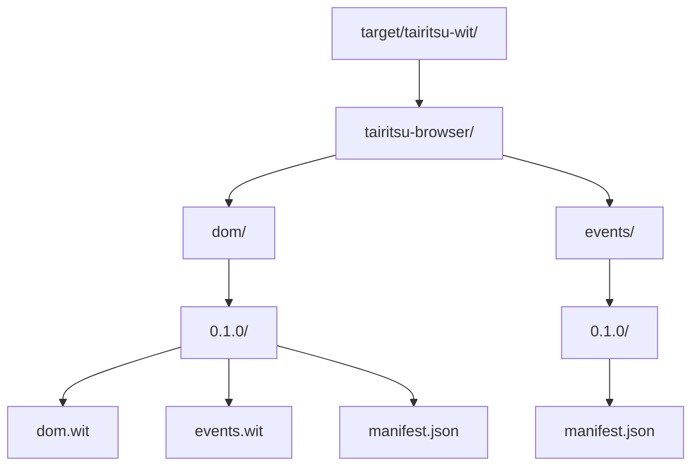

# tairitsu-browser-wit-resolver

WIT package resolver with caching and offline support.

## Overview

`tairitsu-browser-wit-resolver` resolves WIT package dependencies from multiple sources with automatic caching and fallback support.

## Features

- **Local Cache**: Stores resolved packages in `target/tairitsu-wit/`
- **Network Fetch**: Downloads packages from registry
- **Embedded Fallback**: Uses bundled packages when offline
- **Offline Mode**: Works without network access
- **Integrity Verification**: SHA-256 hash verification

## Package Specification

WIT packages are specified as:

```
namespace:name@version
```

Example: `tairitsu-browser:dom@0.1.0`

## Usage

### Basic Resolution

```rust
use tairitsu_browser_wit_resolver::{Resolver, ResolveOptions, PackageSpec};

let opts = ResolveOptions::new("./target");
let resolver = Resolver::new(opts);

let spec = PackageSpec::parse("tairitsu-browser:dom@0.1.0")?;
let package = resolver.resolve(&spec)?;

println!("WIT files at: {}", package.wit_dir.display());
```

### Multiple Packages

```rust
let specs = vec![
    PackageSpec::parse("tairitsu-browser:dom@0.1.0")?,
    PackageSpec::parse("tairitsu-browser:events@0.1.0")?,
];

let packages = resolver.resolve_all(&specs)?;
```

### Offline Mode

```bash
export TAIRITSU_WIT_OFFLINE=1
```

When offline mode is enabled:

- Network requests are skipped
- Only cached/embedded packages are used
- Fails fast if package not available

### Custom Registry

```bash
export TAIRITSU_WIT_REGISTRY="https://my-registry.com"
```

## Cache Structure



## Resolution Order

1. **Local Cache**: Check `target/tairitsu-wit/`
2. **Embedded Packages**: Use bundled packages (if feature enabled)
3. **Network Fetch**: Download from registry (if not offline)
4. **Store in Cache**: Save for future use

## Manifest Format

Each cached package has a `manifest.json`:

```json
{
  "id": "tairitsu-browser:dom@0.1.0",
  "file_hashes": {
    "dom.wit": "abc123...",
    "events.wit": "def456..."
  }
}
```

## API

### `PackageSpec`

Parse and represent package specifications:

```rust
let spec = PackageSpec::parse("tairitsu-browser:dom@0.1.0")?;
assert_eq!(spec.namespace, "tairitsu-browser");
assert_eq!(spec.name, "dom");
assert_eq!(spec.version, "0.1.0");
assert_eq!(spec.id(), "tairitsu-browser:dom@0.1.0");
```

### `ResolveOptions`

Configure resolver behavior:

```rust
let opts = ResolveOptions {
    target_dir: PathBuf::from("./target"),
    registry_url: "https://my-registry.com".to_string(),
    offline: true,
};
```

### `Resolver`

Main resolver entry point:

```rust
let resolver = Resolver::new(opts);

// Resolve single package
let package = resolver.resolve(&spec)?;

// Resolve multiple packages
let packages = resolver.resolve_all(&specs)?;
```

## CLI Integration

The packager uses this resolver for WIT dependencies:

```bash
# Download WIT packages
tairitsu wit fetch tairitsu-browser:dom@0.1.0

# List cached packages
tairitu wit list

# Clear cache
tairitu wit clean
```

## See Also

- [WIT Pipeline](../../docs/en-US/system/wit-pipeline.md): WIT generation process
- [tairitsu-browser-worlds](../browser-worlds): WIT definitions
- [Registry](https://registry.tairitsu.dev): Package registry
